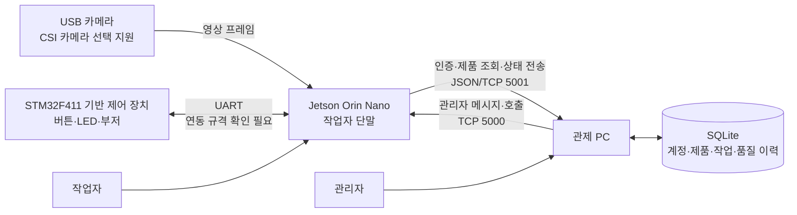
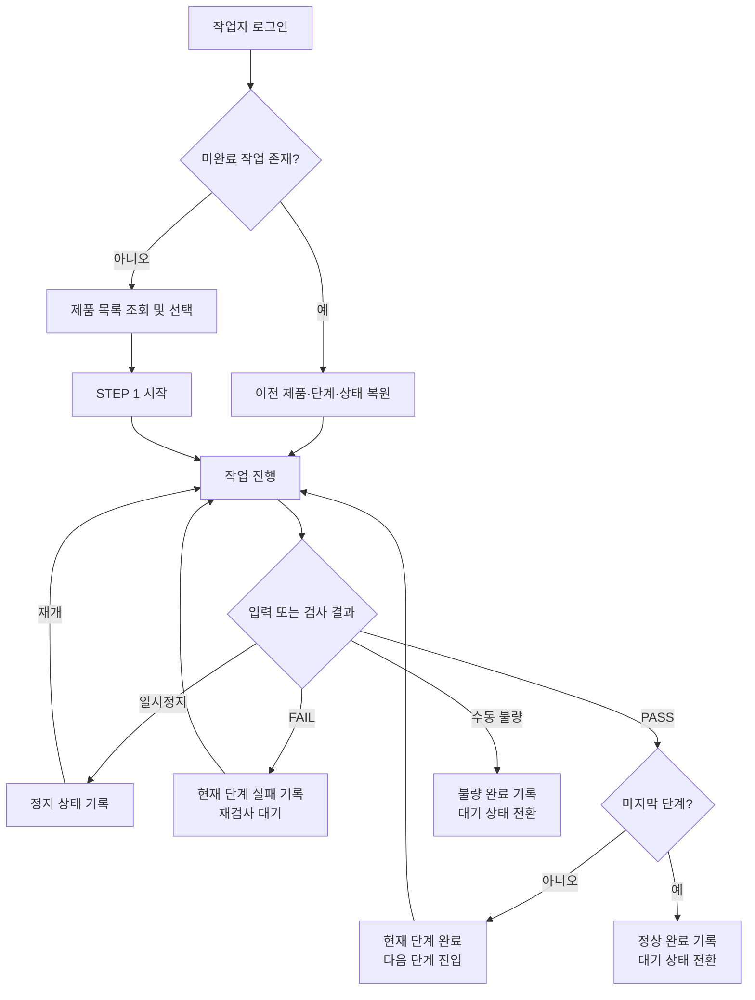

# Jetson Orin Nano 기반 생산 공정 모니터링 시스템 상위설계서

| 항목 | 내용 |
|---|---|
| 프로젝트명 | Team STEP (Sequential Tracking & Error Prevention) |
| 문서 목적 | 시스템의 전체 구조, 역할, 동작 흐름 및 주요 기능 정의 |
| 설계 기준 | 작업자용 Jetson 프로그램, 관리자용 관제 프로그램, STM32 펌웨어 및 설정 파일 |
| 작성 수준 | 대학생·국비교육 팀 프로젝트 상위설계 |

> 본 문서는 소스코드를 근거로 시스템의 목적과 구조를 상위 수준에서 정리한 문서이다. 실제 AI 모델 및 일부 하드웨어 연동처럼 아직 확인되지 않은 부분은 구현된 것으로 표현하지 않고 별도로 표시하였다.

## 1. 프로젝트 개요

### 1.1 프로젝트 목적

본 프로젝트는 제품 조립 작업을 단계별로 관리하고, 작업 현장의 진행 상황과 검사 결과를 관리자에게 전달하는 생산 공정 모니터링 시스템을 개발하는 것을 목적으로 한다. 작업자는 현장 단말에서 제품과 작업 단계를 확인하고 작업 시작, 일시정지, 재개, 검사 및 불량 등록을 수행한다. 관리자는 별도의 관제 PC에서 작업자의 출근 여부, 현재 작업 제품, 진행 단계, 검사 결과와 작업 이력을 확인한다.

이를 통해 수작업으로 관리하기 쉬운 공정 진행 정보와 품질 기록을 전산화하고, 작업자 단말과 관제 화면 사이의 정보 전달을 일관된 형태로 유지하도록 설계한다.

### 1.2 시스템 개념과 범위

시스템은 현장의 **Jetson Orin Nano 작업자 단말**, 물리 조작 및 표시를 담당하는 **STM32 제어 장치**, 데이터를 관리하는 **관제 PC**로 구성된다. 카메라 영상과 작업자 입력은 Jetson에서 받아들이고, 공정 상태로 정리된 정보는 네트워크를 통해 관제 PC로 전달한다. 관제 PC는 수신 데이터를 저장하고 관리자 화면에 표시하며, 필요한 경우 작업자 단말로 메시지를 보낸다.

현재 구현 범위는 다음과 같다.

- 작업자와 관리자의 로그인 및 작업자 세션 관리
- 제품 선택과 단계별 작업 진행 관리
- 카메라 영상 표시 및 검사 판정 실행 구조
- PASS, FAIL, 일시정지, 재개 및 수동 불량 처리
- 작업 상태, 작업시간, 검사 및 불량 이력 저장
- 관리자용 직원·제품·품질 현황 조회 및 관리
- Jetson과 관제 PC 사이의 양방향 TCP 통신
- STM32의 버튼 입력, 단계 LED 및 판정 부저 제어

### 1.3 핵심 기능

| 구분 | 핵심 기능 |
|---|---|
| 현장 작업 지원 | 제품 선택, 현재 단계 표시, 작업 시작·일시정지·재개, 작업 진행률 표시 |
| 영상 및 검사 | USB 또는 CSI 카메라 영상 표시, 사용자가 요청한 시점의 검사 판정 수행 |
| 공정 상태 관리 | 단계별 PASS/FAIL 처리, 마지막 단계 완료, 수동 불량 등록, 미완료 작업 복원 |
| 설비 연동 | STM32 버튼 입력과 UART 통신, 단계 LED 및 PASS/FAIL 부저 표시 |
| 관제 및 기록 | 작업자 접속 상태, 제품 진행 상태, 작업시간, 일시정지, 검사 및 불량 이력 저장·조회 |
| 관리자 통신 | 로그인한 작업자 단말로 관리자 메시지 또는 호출 전달 |

### 1.4 Jetson Orin Nano의 역할

Jetson Orin Nano는 작업 현장에 설치되는 핵심 엣지 컴퓨팅 장치이다. 카메라 영상을 입력받아 작업자 화면에 표시하고, 검사 요청이 발생하면 최신 영상을 판정 모듈에 전달한다. 또한 작업 단계와 판정 결과를 관리하고, STM32 및 관제 PC 사이의 통신을 중계한다.

Jetson을 사용하는 이유는 영상 입력, 그래픽 사용자 화면, 직렬 통신 및 네트워크 통신을 한 장치에서 처리할 수 있고, 향후 GPU 기반 영상 검사 모델을 적용할 수 있는 확장성을 제공하기 때문이다. 단, 현재 소스에는 실제 PyTorch·TensorRT 검사 모델이 연결되어 있지 않으며 모의 판정 방식이 사용되고 있다.

## 2. 시스템 구성

### 2.1 전체 시스템 구성



Jetson은 현장 입력과 공정 상태를 처리하며, 관제 PC는 여러 작업자 단말의 인증과 데이터 저장을 담당한다. 작업 상태는 Jetson에서 관제 PC 방향으로 전달되고, 관리자 메시지는 반대 방향으로 전달된다. 로그인 시 확인한 작업자 단말의 IP 주소를 이용하여 메시지 대상을 결정한다.

### 2.2 하드웨어 구성

| 구성 요소 | 역할 | 확인된 구성 |
|---|---|---|
| Jetson Orin Nano | 작업자 화면, 카메라 입력, 판정 요청, 공정 상태 관리, UART/TCP 통신 | 프로젝트 대상 장치 |
| 카메라 | 작업 대상 영상을 Jetson에 제공 | 현재 설정은 USB 카메라 0번, 1280×720, 30 FPS |
| CSI 카메라 | Jetson 전용 카메라 입력 대안 | GStreamer 입력 구성이 준비되어 있으나 실제 장비 사용 여부는 확인 필요 |
| STM32 제어 장치 | 물리 버튼 입력, 작업 단계 LED, PASS/FAIL 부저 출력 | STM32F411 계열 펌웨어 확인 |
| 버튼 3개 | 검사 요청, 일시정지·재개, 초기화·불량 처리 입력 | 펌웨어에 입력 처리 존재 |
| LED | 현재 작업 단계 및 실패 상태 표시 | 단계 표시와 실패 표시 제어 존재 |
| 부저 | 검사 성공·실패에 대한 청각적 알림 | 서로 다른 성공·실패 음향 제어 존재 |
| 관제 PC | 관리자 화면 실행, 인증, 데이터 저장 및 작업자 관리 | 단일 PC와 SQLite 중심 구성 |

카메라와 STM32의 정확한 제품명, 결선도, 전원 구성은 저장소에서 확인되지 않으므로 별도 확인이 필요하다.

### 2.3 소프트웨어 구성

| 계층 | 구성 | 주요 책임 |
|---|---|---|
| 작업자 화면 | Jetson용 데스크톱 UI | 로그인, 제품 선택, 영상·진행률·판정·장치 상태 표시 |
| 현장 입력 처리 | 카메라 및 UART 처리 | 영상 프레임 수신, STM32 명령 수신, 장치 연결 상태 확인 |
| 판정 처리 | 교체 가능한 검사 판정 계층 | 최신 영상 한 장을 받아 PASS 또는 FAIL 결과 생성 |
| 공정 제어 | 작업 상태 관리 | 대기, 진행, 일시정지, 단계 전환, 완료, 불량 처리 |
| 통신 | Jetson–관제 PC TCP 통신 | 인증, 제품 조회, 상태 전송, 관리자 메시지 수신 |
| 관제 화면 | 관리자용 데스크톱 UI | 직원·제품·작업·품질 현황 조회 및 계정·제품 관리 |
| 데이터 관리 | SQLite 저장소 | 근무, 제품 작업, 단계, 정지, 판정, 불량 및 원본 상태 기록 |
| 장치 제어 | STM32 펌웨어 | 버튼 인터럽트, UART, LED 및 부저 제어 |

### 2.4 통신 및 데이터 구성

Jetson과 관제 PC의 업무 데이터는 TCP 소켓을 통해 전달한다. 작업자 인증, 제품 목록 요청, 상태 보고 및 로그아웃은 한 줄 단위 JSON 메시지로 처리하며 관제 PC의 5001번 포트를 사용한다. 인증 성공 후 발급된 세션 토큰과 로그인 IP를 함께 확인하여 다른 작업자의 정보로 상태를 전송하지 못하도록 한다.

관리자 메시지는 관제 PC에서 Jetson의 5000번 포트로 전달한다. 메시지 내용은 UTF-8 문자를 안전하게 전달할 수 있도록 인코딩되며, Jetson은 수신 대상 직원번호가 현재 로그인한 작업자와 일치할 때 화면에 표시한다.

관제 데이터는 직원, 제품, 근무 세션, 제품 작업, 단계 작업, 일시정지, 검사 판정, 불량 및 상태 이벤트 단위로 구분하여 저장한다. 이 구조를 통해 현재 상태뿐 아니라 작업시간과 품질 이력을 함께 조회할 수 있다.

## 3. 시스템 동작 설계

### 3.1 시작 및 로그인 흐름

1. 관제 PC가 시작되면 데이터 저장소를 준비하고 작업자 요청 수신 서비스를 실행한다.
2. Jetson 작업자 프로그램은 로그인 화면을 표시하고 직원번호와 비밀번호를 입력받는다.
3. 입력된 정보는 관제 PC로 전송되며, 관제 PC는 작업자 계정을 확인한 뒤 세션 토큰을 발급한다.
4. 이전에 완료되지 않은 작업이 있으면 제품, 현재 단계 및 일시정지 여부를 함께 반환한다.
5. 로그인 성공 후 Jetson은 카메라, 판정 처리, UART 수신, 관리자 메시지 수신 및 상태 전송 기능을 시작한다.
6. Jetson은 관제 PC에서 제품 목록과 전체 단계 수를 받아 작업자에게 표시한다.

### 3.2 작업 수행 흐름



작업자는 제품을 선택하고 작업을 시작한다. 작업 중 카메라 영상은 계속 화면에 표시되지만 검사는 자동으로 반복 실행되지 않는다. 작업자가 검사 실행을 요청할 때 최신 영상 한 장이 판정 대상으로 전달된다. PASS이면 다음 단계로 이동하고, 마지막 단계의 PASS이면 제품 작업을 정상 완료한다. FAIL이면 현재 단계를 유지하여 재검사가 가능하다. 수동 불량을 등록하면 해당 제품 작업을 불량으로 종료하고 초기 대기 상태로 돌아간다.

### 3.3 데이터 처리 흐름

```text
카메라·작업자 조작·STM32 입력
            ↓
Jetson 입력 수신 및 화면 표시
            ↓
검사 판정 또는 공정 상태 판단
            ↓
현재 제품·STEP·상태·판정 결과 생성
            ↓
관제 PC로 순차 전송
            ↓
유효성 검사 및 SQLite 이력 저장
            ↓
관리자 화면의 직원 현황·작업 이력·품질 통계 갱신
```

관제 PC는 등록된 작업자와 제품인지, 단계 번호가 제품의 전체 단계 범위 안에 있는지 확인한 후 데이터를 저장한다. 같은 일반 상태가 연속으로 전송된 경우에는 중복 기록을 줄이고, 반복 FAIL은 재검사 횟수로 활용할 수 있도록 개별 판정으로 기록한다. 일시정지와 재개 시점은 단계별 작업시간과 구분하여 저장한다.

### 3.4 종료 및 예외 흐름

작업자가 로그아웃하면 Jetson은 관제 PC에 세션 종료를 요청하고 카메라, 판정, UART 및 TCP 처리 기능을 정리한 뒤 로그인 화면으로 돌아간다. 프로그램 전체를 종료할 때도 실행 중인 장치 처리와 통신을 정리한다.

카메라나 UART 장치 연결에 실패한 경우에는 장치 상태와 작업 기록 화면에 오류를 표시하고 재연결을 시도할 수 있다. 반면 관제 PC와의 연결이 끊기면 데이터 누락을 방지하기 위해 오류를 알리고 작업자 프로그램을 종료하도록 설계되어 있다.

## 4. 주요 기능 설계

### 4.1 작업자 운용 기능

| 기능명 | 기능 목적 | 입력 | 처리 내용 | 출력 결과 |
|---|---|---|---|---|
| 작업자 인증 및 작업 복원 | 허가된 작업자만 시스템을 사용하고 중단된 작업을 이어서 수행하도록 한다. | 직원번호, 비밀번호, 접속 IP | 관제 PC에서 계정을 확인하고 토큰을 발급한다. 미완료 작업이 있으면 제품과 현재 단계를 조회한다. | 로그인 결과, 작업자 정보, 세션 토큰, 복원할 작업 상태 |
| 제품 선택 및 작업 시작 | 등록된 제품의 단계 수에 따라 작업을 시작하도록 한다. | 제품 목록, 작업자 제품 선택, 시작 입력 | 선택 제품과 전체 단계 수를 설정하고 첫 번째 단계부터 진행 상태를 생성한다. | 선택 제품 정보, 현재 단계, 작업 진행 상태 |
| 단계별 공정 진행 | 작업 결과에 따라 다음 단계 이동 또는 제품 완료를 결정한다. | 현재 단계, PASS/FAIL 결과 | PASS는 다음 단계로 이동하며 마지막 단계이면 정상 완료한다. FAIL은 현재 단계를 유지한다. | 갱신된 단계, 진행률, 판정 결과, 완료 상태 |
| 일시정지 및 재개 | 작업 중단 시간을 구분하여 관리한다. | 일시정지 또는 재개 입력 | 현재 진행 중인 단계를 정지 상태로 바꾸거나 같은 단계에서 작업을 재개한다. | 정지·재개 상태와 해당 시점 기록 |
| 수동 불량 등록 | 작업자가 확인한 불량 제품을 정상 완료와 구분한다. | 작업 중 불량 등록 입력 | 현재 단계와 제품 작업을 불량으로 종료하고 새 작업이 가능한 대기 상태로 전환한다. | 불량 이력, 불량 완료 결과, 초기 대기 상태 |

### 4.2 영상·판정 및 장치 연동 기능

| 기능명 | 기능 목적 | 입력 | 처리 내용 | 출력 결과 |
|---|---|---|---|---|
| 카메라 영상 모니터링 | 작업 대상 영상을 작업자에게 실시간으로 제공한다. | USB 카메라 또는 CSI 카메라 프레임 | 별도 처리 흐름에서 영상을 읽고 화면 크기에 맞추어 표시하며 최신 프레임을 보관한다. | 실시간 영상, 카메라 연결 상태 |
| 검사 판정 | 현재 단계의 검사 결과를 표준 PASS/FAIL 형태로 생성한다. | 작업자가 요청한 시점의 최신 영상 | 화면 동작을 막지 않는 별도 처리 흐름에서 판정을 수행하고 결과와 신뢰도를 반환한다. 현재는 모의 판정으로 동작한다. | PASS/FAIL, 신뢰도, 판정 설명 |
| STM32 물리 입력 | 작업자가 화면 외의 버튼으로 주요 공정 동작을 요청할 수 있도록 한다. | 검사, 일시정지·재개, 초기화 버튼 | 버튼 입력을 인터럽트로 감지하고 UART 명령으로 전달한다. | Jetson으로 전달되는 제어 요청 |
| 현장 상태 알림 | 현재 단계와 판정 결과를 시각·청각으로 알린다. | 시작·PASS·FAIL 상태 | 단계 LED를 전환하고 성공·실패에 따라 서로 다른 부저 동작을 수행한다. | 단계 LED, 실패 LED, 성공·실패 음향 |
| 장치 상태 관리 | 카메라, UART, 판정 처리 및 메시지 수신 기능의 이상을 작업자에게 알린다. | 각 장치의 연결 및 동작 상태 | 정상·오류 상태를 화면과 로그에 표시하고 사용자 요청 시 재연결을 시도한다. | 장치 상태 표시, 오류 기록, 재연결 결과 |

### 4.3 관제 및 데이터 관리 기능

| 기능명 | 기능 목적 | 입력 | 처리 내용 | 출력 결과 |
|---|---|---|---|---|
| 작업 상태 전송 및 저장 | 현장 공정 정보를 관제 PC에 누적하여 추적 가능하게 한다. | 제품, 단계, 작업 상태, 판정, 이벤트 정보 | 세션을 확인하고 데이터 범위를 검증한 뒤 원본 상태와 작업·단계·품질 이력으로 저장한다. | 저장 결과, 관리자 화면 갱신 신호 |
| 직원 및 근무 현황 관리 | 작업자의 접속과 작업 상황을 관리자가 확인하도록 한다. | 로그인·로그아웃과 작업 상태 | 근무 시작·종료 시점을 관리하고 현재 제품 및 단계를 직원별로 정리한다. | 직원 목록, 근무 상태, 현재 작업 현황 |
| 작업·품질 이력 조회 | 단계별 작업시간과 품질 결과를 분석할 수 있도록 한다. | 저장된 공정 상태와 판정 기록 | 제품 작업, 단계 작업, 일시정지, PASS/FAIL 및 수동 불량을 관계별로 조회·집계한다. | 작업시간, 정지 이력, 검사 FAIL률, 불량 현황 |
| 계정 및 제품 관리 | 작업 대상과 시스템 사용자를 관제 PC에서 관리한다. | 관리자 입력 | 작업자 계정 등록·말소와 제품 등록·수정·삭제, 전체 단계 수를 관리한다. | 갱신된 직원 및 제품 정보 |
| 관리자 메시지 전달 | 관리자가 특정 작업자에게 공지나 호출을 전달하도록 한다. | 대상 직원, 메시지 | 로그인 시 확인된 Jetson IP로 대상 정보와 메시지를 전송한다. | Jetson 화면의 호출 배너 또는 메시지 창 |

## 5. 개발 환경

### 5.1 하드웨어 및 운영 환경

| 항목 | 확인 내용 | 비고 |
|---|---|---|
| 작업자 처리 장치 | NVIDIA Jetson Orin Nano | 프로젝트 대상 장치 |
| Jetson 운영체제 | Ubuntu Linux, ARM64 기준 | Ubuntu 세부 버전 확인 필요 |
| JetPack | 확인 필요 | 저장소에 버전 정보 없음 |
| 관제 PC 운영체제 | 확인 필요 | 프로그램은 Python/PyQt 기반이며 저장소만으로 실제 운영 OS를 확정할 수 없음 |
| 마이크로컨트롤러 | STM32F411 계열, Arm Cortex-M4 | 정확한 보드 모델 확인 필요 |
| 카메라 | USB 카메라가 현재 설정됨 | 제조사·모델 확인 필요 |
| CSI 카메라 | 입력 방식 지원 | 실제 사용 장비 및 동작 확인 필요 |
| 기타 장치 | 버튼, 단계·실패 표시 LED, 부저 | 회로 및 부품 규격 확인 필요 |

### 5.2 소프트웨어 및 라이브러리

| 항목 | 확인된 사용 범위 | 버전 |
|---|---|---|
| Python | Jetson 작업자 프로그램 및 관제 프로그램 | 관제 프로그램은 3.10 이상, Jetson의 정확한 버전 확인 필요 |
| PyQt5 | 작업자·관리자 그래픽 화면 및 비동기 처리 | 5.15 이상, 6 미만(관제); Jetson 설치 버전 확인 필요 |
| OpenCV | USB/CSI 카메라 입력, 영상 크기·색상 변환 | 개발 환경 기준 4.5 이상, Jetson 실제 버전 확인 필요 |
| GStreamer | Jetson CSI 카메라 입력 파이프라인 | 설치·지원 버전 확인 필요 |
| pyserial | Jetson–STM32 UART 통신 | 3.5 이상 |
| NumPy | Jetson 영상·데이터 처리 보조 의존성 | 1.19 이상 |
| SQLite | 계정, 제품, 공정 및 품질 데이터 저장 | Python 기본 모듈 사용, 엔진 버전 확인 필요 |
| TCP Socket / JSON | Jetson–관제 PC 통신 | Python 표준 라이브러리 사용 |
| C | STM32 펌웨어 | GNU C99 |
| Arm GNU Toolchain | STM32 교차 컴파일 | 설정 파일 기준 15.2.1 |

### 5.3 AI 및 가속 환경

| 기술 | 현재 상태 |
|---|---|
| 모의 AI 판정 | 구현 및 기본 설정됨. 영상 내용과 무관하게 시험용 PASS/FAIL 결과를 생성함 |
| PyTorch | 연결 지점만 준비되어 있으며 실제 판정 구현은 없음 |
| TensorRT | 연결 지점만 준비되어 있으며 실제 판정 구현은 없음 |
| CUDA | 소스에서 직접 사용하는 기능이 확인되지 않음 |
| YOLO | 사용 흔적이 확인되지 않음 |

따라서 현재 시스템을 “AI 객체 인식 완료 시스템”으로 정의할 수는 없다. 현재 단계는 카메라 영상과 검사 판정 절차를 연결할 수 있는 구조를 갖추고, 모의 판정으로 전체 공정 흐름을 시험하는 상태이다.

## 6. 시험 및 향후 계획

### 6.1 시험 항목

| 시험 구분 | 시험 내용 | 합격 기준 |
|---|---|---|
| 프로그램 시작 | 관제 PC의 저장소·수신 서비스와 Jetson 작업자 화면이 정상 시작되는지 확인 | 오류 없이 로그인 화면과 수신 대기 상태가 표시됨 |
| 인증 및 보안 | 정상·오류 계정, 토큰 만료, 로그인 IP와 요청 IP 불일치를 시험 | 정상 사용자만 접속하고 잘못된 세션 요청은 거부됨 |
| 제품 정보 연동 | 관제 PC에 등록한 제품과 단계 수가 Jetson에 표시되는지 확인 | 제품명·제품번호·전체 단계가 동일함 |
| 작업 상태 전이 | 시작, PASS, FAIL, 정지, 재개, 수동 불량 및 최종 완료를 시험 | 정의된 상태와 단계 순서대로 전환되고 잘못된 입력은 제한됨 |
| 미완료 작업 복원 | 진행 또는 정지 중 프로그램을 종료하고 다시 로그인 | 이전 제품과 단계 및 정지 여부가 복원됨 |
| 카메라 입력 | USB 카메라 연결·분리·재연결과 목표 해상도·프레임 수신을 확인 | 영상이 지속 표시되고 오류와 복구 상태가 구분됨 |
| 검사 판정 | 최신 프레임 전달, 판정 중 화면 응답, PASS/FAIL 반영을 확인 | 화면 정지 없이 결과가 현재 단계에 정확히 반영됨 |
| UART 장치 연동 | STM32 버튼 명령의 내용과 종료 문자를 Jetson 수신 규격과 함께 확인 | 모든 버튼 입력이 한 번씩 정확한 공정 동작으로 변환됨 |
| LED·부저 출력 | 시작, 단계 통과, 실패 및 초기화 상황을 시험 | 단계 LED와 성공·실패 음향이 상태와 일치함 |
| 관제 데이터 저장 | 근무, 제품, 단계, 정지, 판정 및 불량 데이터를 조회 | 화면 상태와 저장 이력이 일치하고 일반 중복 상태가 억제됨 |
| 관리자 메시지 | 로그인한 직원과 다른 직원 대상으로 메시지를 전송 | 대상 직원의 Jetson에만 메시지가 표시됨 |
| 장애 대응 | 카메라·UART·관제 서버 연결을 각각 차단 후 복구 | 장치 오류는 표시·재연결되고 서버 단절은 알림 후 안전 종료됨 |
| 성능 및 안정성 | 장시간 카메라·통신·화면 동작과 반복 판정을 수행 | 메모리 증가, 화면 멈춤, 상태 유실 또는 순서 변경이 발생하지 않음 |

### 6.2 현재 확인 결과와 제약사항

- 관제 PC의 상태 저장, 집계, 복원, 제품 검증, 작업자 토큰 및 IP 연결 등을 대상으로 한 자동 회귀시험 22건이 통과하였다.
- Jetson 실제 장비에서의 USB/CSI 카메라, UART, 장시간 동작 및 성능 시험 결과는 저장소에서 확인되지 않는다.
- 현재 검사 판정은 모의 방식이므로 실제 제품의 결함을 판별하는 정확도 시험 대상이 아니다.
- STM32는 `Check`, `Pause`, `Restart`, `Reset` 의미의 명령을 전송하지만 Jetson은 `PASS`, `FAIL`, `PAUSE`, `RESUME`, `RESET`, `START` 형식을 해석한다. 또한 Jetson 수신은 줄 단위 메시지를 기준으로 하므로 명령어와 종료 문자 규격을 통일한 뒤 통합 시험이 필요하다.
- 작업 상태를 관제 PC로 보내는 경로가 하나로 유지되는지 확인이 필요하다. 특히 반복 FAIL은 각각 품질 판정으로 저장되므로 동일 이벤트가 중복 전송되지 않는지 점검해야 한다.
- JetPack, Ubuntu 세부 버전, 실제 카메라 모델과 STM32 보드·회로 정보는 별도 장비 문서에서 확인해야 한다.

### 6.3 향후 계획

1. **STM32–Jetson 통신 규격 통일**  
   검사 요청과 판정 결과를 구분하고, 명령어 명칭·대소문자·줄바꿈·응답 방향을 하나의 UART 규격으로 확정한다.

2. **실제 영상 검사 모델 적용**  
   현재 모의 판정 부분을 실제 프로젝트 대상 제품의 검사 모델로 교체하고, Jetson GPU 환경에서 정확도와 처리 시간을 측정한다. 적용 기술은 모델이 확정된 뒤 PyTorch 또는 TensorRT 중에서 선택한다.

3. **Jetson 장비 최적화**  
   실제 JetPack과 OpenCV/GStreamer 버전을 확정하고, 카메라 해상도·프레임 속도·추론 속도를 조정하여 안정적인 현장 동작 조건을 정한다.

4. **통신 및 상태 일관성 강화**  
   상태 전송 경로를 단일화하고 재전송·중복·순서 변경 상황을 시험한다. 관제 서버 단절 시 작업 데이터 처리 정책도 현장 운영 방식에 맞게 보완한다.

5. **사용자 화면 개선**  
   작업자가 현재 단계, 판정 결과, 장치 오류와 관리자 메시지를 더 빠르게 구분할 수 있도록 실제 사용자 시험을 진행하고 표시 방식과 안내 문구를 개선한다.

6. **통합 및 장시간 시험 확대**  
   Jetson, 카메라, STM32, 관제 PC를 실제 네트워크에서 연결한 뒤 반복 작업, 재로그인, 장치 분리, 서버 재시작 및 장시간 운전 시험을 수행한다.

### 6.4 설계 일치성 검토 결과

본 문서는 실제 소스와 설정에서 확인된 기능만을 현재 기능으로 반영하였다. USB 카메라, 단계별 공정 제어, 관제 통신, 데이터 저장 및 관리자 화면은 구현 범위로 정리하였다. CSI 카메라는 선택 가능한 입력 방식으로, PyTorch·TensorRT는 향후 교체 가능한 기술로 구분하였다. STM32와 Jetson 사이에는 양쪽 프로그램이 존재하지만 현재 명령 규격 차이가 있으므로 완전한 통합 기능으로 단정하지 않고 연동 시험 필요사항으로 표시하였다.
