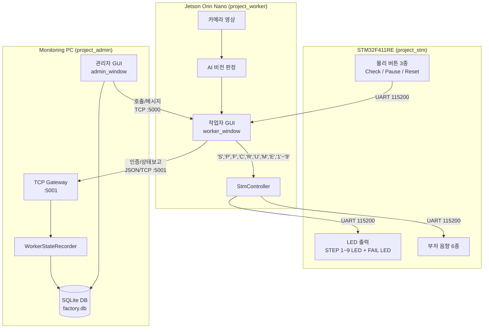

# AI 기반 표준 공정 관리 시스템 (AI Standard Process System)

스마트 팩토리 조립 공정을 위한 **AI 비전 검사 기반 표준 공정 추적 및 관제 시스템**입니다.

하드웨어 제어기(STM32), 작업자 단말(Jetson Orin Nano / PyQt5), 중앙 관제 PC(PyQt5 / SQLite)가 유기적으로 연동되어 조립 공정의 단계별(STEP) 진행, AI 품질 판정, 불량 추적, 실시간 모니터링을 수행합니다.

---

## 1. 전체 시스템 아키텍처



---

## 2. 서브 프로젝트 구성

| 디렉토리 | 플랫폼 | 주요 기술 | 설명 | 상세 문서 |
|:---|:---|:---|:---|:---|
| [`project_stm/`](project_stm/) | STM32F411RE | C (Bare-metal), ARM GCC | 물리 버튼 입력, STEP 1~9 및 FAIL LED, 6종 부저 음향 제어 펌웨어 | [STM32 README](project_stm/README.md) |
| [`project_worker/`](project_worker/) | Jetson Orin Nano / Linux | Python 3, PyQt5, OpenCV | 카메라 영상 표시, AI 판정, 공정 상태 머신, STM32 UART 연동 작업자 앱 | [Worker README](project_worker/README.md) |
| [`project_admin/`](project_admin/) | 관제 PC / Linux | Python 3, PyQt5, SQLite | 실시간 공정 모니터링, 작업 상태 보존/복원, 계정 및 품질 통계 관제 앱 | [Admin README](project_admin/README.md) |

### 루트 실행 및 환경 구성 파일

| 파일 | 역할 | 설명 |
|:---|:---|:---|
| [`run_admin.sh`](run_admin.sh) | 관제 PC 실행 | 가상환경 및 패키지 자동 감지·설치 후 관리자 GUI 즉시 실행 |
| [`run_worker.sh`](run_worker.sh) | 작업자 앱 실행 | UART udev 영구 권한, 가상환경, 패키지 자동 세팅 후 작업자 GUI 즉시 실행 |
| [`requirements.txt`](requirements.txt) | 통합 패키지 명세 | Admin, Worker, AI 추론, 테스트 도구 전체를 단일 파일로 관리 |

---

## 3. 핵심 공정 흐름

1. **작업자 로그인 및 복원**:
   - 작업자가 로그인하면 관제 서버에서 이전 미완료 작업(제품번호, 진행 STEP, 일시정지 상태)을 확인하여 자동 복원.
   - 복원된 STEP 정보를 STM32로 전송하여 해당 STEP LED 점등 및 버튼 활성화.
2. **조립 및 AI 판정 진행**:
   - 작업자가 STM32의 Check 버튼(또는 GUI 판정 버튼)을 누르면 카메라 프레임을 기반으로 AI 비전 추론 실행.
   - **PASS**: 다음 STEP으로 자동 전이, STM32의 다음 STEP LED 점등 및 PASS 멜로디 재생.
   - **FAIL**: FAIL 경보 LED 점등 및 경보음 재생, 재검사 대기.
   - **전체 완료**: 제품의 모든 STEP 통과 시 관제 서버에 완료 보고 후 완료 팡파레 부저 재생.
3. **일시정지 및 불량 처리**:
   - STM32 또는 GUI에서 일시정지/재개 가능 (일시정지 시간 누적 기록).
   - 수동 불량 등록 시 불량 사유 및 회차가 기록되고 0단계 대기 상태로 초기화.
4. **안전한 종료**:
   - 로그아웃 또는 프로그램 종료 시 STM32에 프로그램 종료 명령(`'E'`)을 전송하여 모든 LED와 부저를 끄고 대기 상태로 안전하게 전환.

---

## 4. 빠른 시작

> [!IMPORTANT]
> **모든 프로그램 실행은 반드시 프로젝트 최상위 루트 디렉토리(`AI_Standard_Process_System/`)에서 수행해야 합니다.**  
> 하위 폴더(`project_admin/`, `project_worker/`)로 이동하여 실행하지 마십시오.

### 4.1 프로그램 실행 (최초 실행 시 환경 자동 세팅)
가상환경 설치나 권한 설정을 별도로 할 필요 없이, 프로젝트 루트 디렉토리에서 아래 스크립트만 실행하면 **최초 1회 패키지 및 UART 권한이 자동 설정된 후 바로 실행**됩니다:

- **중앙 관제 프로그램 (Admin) 실행**:
  ```bash
  bash run_admin.sh
  ```

- **작업자 프로그램 (Worker) 실행**:
  ```bash
  bash run_worker.sh
  ```
  *(장비 없이 PC에서 테스트할 경우 `project_worker/config.py`의 `TEST_MODE = True` 설정 시 가상 카메라와 Mock AI로 동작)*

---

### 4.2 STM32 펌웨어 빌드 및 플래싱 (필요 시)
```bash
cd project_stm
make clean && make
make run  # ST-LINK로 플래싱
```
