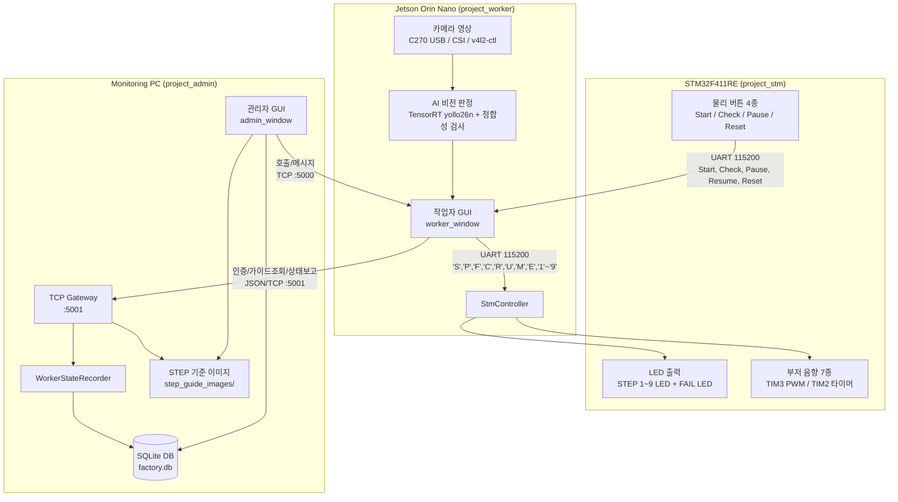

# AI 기반 표준 공정 관리 시스템 (AI Standard Process System)

스마트 팩토리 조립 공정을 위한 **AI 비전 검사 기반 표준 공정 추적 및 관제 시스템** (Team STEP)입니다.

하드웨어 제어기(STM32F411RE), 작업자 단말(Jetson Orin Nano / PyQt5), 중앙 관제 PC(PyQt5 / SQLite)가 유기적으로 연동되어 조립 공정의 단계별(STEP) 진행, AI 품질 판정, 불량 추적, 실시간 모니터링을 수행합니다.

---

## 1. 전체 시스템 아키텍처



---

## 2. 서브 프로젝트 구성

| 디렉토리 | 플랫폼 | 주요 기술 | 설명 | 상세 문서 |
|:---|:---|:---|:---|:---|
| [`project_stm/`](project_stm/) | STM32F411RE | C (Bare-metal), ARM GCC | 물리 버튼 입력 4종(Start, Check, Pause, Reset), STEP 1~9 및 FAIL LED, 7종 부저 음향 제어 펌웨어 | [STM32 README](project_stm/README.md) |
| [`project_worker/`](project_worker/) | Jetson Orin Nano / Linux | Python 3, PyQt5, OpenCV, TensorRT | 카메라 영상 표시, TensorRT YOLO 비전 판정, 조립 정합성 검사, 공정 상태 머신, STM32 UART 연동 작업자 앱 | [Worker README](project_worker/README.md) |
| [`project_admin/`](project_admin/) | 관제 PC / Windows | Python 3, PyQt5, SQLite | 실시간 공정 모니터링, 작업 상태 보존/복원, 계정 및 제품 관리, STEP 기준 이미지 관리, 데이터 초기화 도구 관제 앱 | [Admin README](project_admin/README.md) |

### 루트 실행 및 환경 구성 파일

| 파일 | 역할 | 설명 |
|:---|:---|:---|
| [`run_admin.bat`](run_admin.bat) | 관제 PC 실행 (Windows CMD) | Windows 원클릭 가상환경(`.venv`) 자동 생성, `requirements_admin.txt` 패키지 자동 동기화 및 관리자 GUI 실행 |
| [`run_admin.ps1`](run_admin.ps1) | 관제 PC 실행 (PowerShell) | Windows PowerShell 전용 가상환경 자동 세팅 및 관리자 GUI 실행 스크립트 |
| [`run_worker.sh`](run_worker.sh) | 작업자 단말 실행 (Jetson/Linux) | Jetson/Linux UART udev 권한 영구 등록, v4l-utils 설치, `.venv` 생성, `requirements_worker.txt` 패키지 동기화 및 작업자 GUI 실행 |
| [`requirements_admin.txt`](requirements_admin.txt) | 관제 PC 패키지 명세 | Admin 관제 PC 전용 경량 패키지 명세 (PyQt5, typing_extensions, 단위 테스트 도구) |
| [`requirements_worker.txt`](requirements_worker.txt) | 작업자 단말 패키지 명세 | Jetson 작업자 단말 패키지 명세 (PyQt5, OpenCV, Ultralytics YOLO, PySerial, 단위 테스트 도구) |

---

## 3. 핵심 공정 흐름

1. **작업자 로그인 및 이전 작업 복원**:
   - 작업자가 로그인하면 관제 서버(:5001)에서 이전 미완료 작업(제품번호, 진행 STEP, 일시정지 상태)을 확인하여 자동 복원.
   - 복원된 STEP 정보를 STM32로 전송(`'1'`~`'9'`)하여 해당 STEP LED 점등 및 버튼 활성화 (복원 대상이 없으면 `'E'` 전송으로 초기 대기).
2. **공정 시작 및 조립**:
   - 제품 선택 후 STM32의 Start 버튼(PB2) 또는 GUI의 시작 버튼을 누르면 작업자 앱이 STM32에 `'S'` 명령을 전달.
   - STM32에서 STEP 1 LED 점등 및 작업 시작 부저음(`SOUND_START`) 재생.
3. **AI 비전 검사 및 판정**:
   - 작업자가 STM32의 Check 버튼(PB3) 또는 GUI 판정 버튼을 누르면 카메라 프레임(v4l2-ctl 최적화)을 기반으로 TensorRT YOLO 추론 실행.
   - 검출된 부품의 상대좌표를 정규화하여 제품 레시피 JSON(`racing_car.json`, `pickup_truck.json`, `bug_fighter.json` 등)과 정합성 비교.
   - **PASS**: 다음 STEP으로 자동 전이, STM32에 `'P'` 명령 전송(다음 STEP LED 점등 및 PASS 멜로디 재생), 서버로 완료 STEP 이력 보고.
   - **FAIL**: STM32에 `'F'` 명령 전송(FAIL 경보 LED 점등 및 경보 부저음 재생), 재검사 대기.
   - **전체 완료**: 제품의 모든 STEP 통과 시 관제 서버에 전체 완료 보고 후 STM32에 `'C'` 명령 전송(전체 완료 팡파레 부저 재생 후 0단계 복귀).
4. **일시정지 및 불량 처리**:
   - STM32 Pause/Resume 버튼(PB4) 또는 GUI 일시정지 버튼을 통해 공정 일시정지/재개 (일시정지 시간 누적 기록, 전용 사운드 재생).
   - 작업 중 부품 파손 등 이상 발생 시 STM32 Reset 버튼(PB5) 또는 GUI 불량 등록 버튼을 눌러 불량 사유/회차 기록 후 STM32에 `'R'` 명령 전송(불량 부저음 재생 후 0단계 대기 초기화).
5. **안전한 종료**:
   - 로그아웃 또는 프로그램 종료 시 STM32에 프로그램 종료 명령(`'E'`)을 전송하여 모든 LED와 부저를 끄고 버튼 인터럽트를 비활성화하여 안전하게 전환.

---

## 4. 빠른 시작

> [!IMPORTANT]
> **모든 프로그램 실행은 반드시 프로젝트 최상위 루트 디렉토리(`AI_Standard_Process_System/`)에서 수행해야 합니다.**  
> 하위 폴더(`project_admin/`, `project_worker/`)로 이동하여 실행하지 마십시오.

### 4.1 중앙 관제 프로그램 실행 (Admin - Windows PC)

가상환경 설치나 의존성 설정을 별도로 할 필요 없이 루트 디렉토리의 스크립트만 실행하면 **최초 1회 패키지 자동 설치 후 바로 실행**됩니다:

- 파일 탐색기에서 `run_admin.bat` 더블 클릭, 또는
- PowerShell / 명령 프롬프트(CMD):
  ```powershell
  .\run_admin.bat
  ```
- (PowerShell 전용 스크립트 실행 시):
  ```powershell
  .\run_admin.ps1
  ```

### 4.2 작업자 프로그램 실행 (Worker - Jetson Orin Nano / Linux)

프로젝트 최상위 루트 디렉토리에서 아래 명령어를 실행하면 **UART udev 권한 등록, v4l-utils 설치, 가상환경 구성 및 패키지 동기화가 자동 수행**된 후 실행됩니다:

```bash
bash run_worker.sh
```

*(장비 없이 PC에서 단독 테스트할 경우 `project_worker/config.py`에서 `TEST_MODE = True`로 변경 시 Mock 카메라와 Mock AI로 동작합니다.)*

### 4.3 개발 및 테스트용 데이터 관리 도구

- **샘플 데이터 생성 (관리자/작업자 계정, 제품, 가상 이력 생성)**:
  ```bash
  python3 project_admin/sample_data.py
  ```
  - 관리자: `admin` / `admin1234`
  - 작업자: `1001` / `worker1234`
- **시스템 데이터 초기화 (관리자 계정 제외 데이터 일괄 삭제)**:
  ```bash
  python3 project_admin/reset_data.py
  ```

### 4.4 STM32 펌웨어 빌드 및 플래싱 (필요 시)

```bash
cd project_stm
make clean && make
make run  # ST-LINK v2를 통한 보드 플래싱
cd ..
```
