# AI 기반 생산 공정 모니터링 시스템 (AI Standard Process System)

<div align="center">

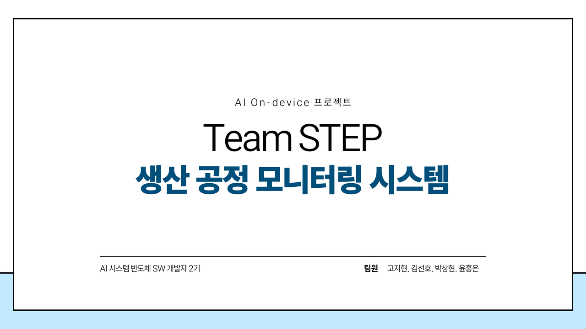

**AI On-device 프로젝트 | AI 시스템 반도체 SW 개발자 2기**  
**Team STEP (Sequential Tracking & Error Prevention)**

| 팀원 | 역할 및 담당 |
|:---:|:---|
| **고지현** | STM32 펌웨어 설계, 하드웨어 회로 및 타이머/인터럽트 제어, AI 모델 경량화 최적화 |
| **김선호** | 중앙 관제(Admin) GUI 개발, TCP/IP 네트워크 통신 구현, SQLite 데이터베이스 설계 및 데이터 무결성 검증 |
| **박상현** | 작업자(Worker) GUI 개발, 멀티스레딩(QThread) 비동기 파이프라인, Linux v4l2-ctl 하드웨어 카메라 튜닝 |
| **윤홍은** | AI 비전 검사 알고리즘 설계, 데이터셋 수집 및 정제 전략 수립, 단계별 상대좌표 조립 정합성 판정 로직 |

</div>

---

## 📋 목 차 (Table of Contents)

1. [01. 프로젝트 개요 (Overview)](#01-프로젝트-개요-overview)
   - [1.1 프로젝트 배경 (기존 공정의 문제점)](#11-프로젝트-배경-기존-공정의-문제점)
   - [1.2 프로젝트 목적](#12-프로젝트-목적)
   - [1.3 프로젝트 목표](#13-프로젝트-목표)
2. [02. 시스템 설계 및 구현 (System Design & Implementation)](#02-시스템-설계-및-구현-system-design--implementation)
   - [2.1 전체 시스템 아키텍처 및 흐름](#21-전체-시스템-아키텍처-및-흐름)
   - [2.2 공정 상태 천이도 (FSM)](#22-공정-상태-천이도-fsm)
   - [2.3 하드웨어 부품 목록 (Part List)](#23-하드웨어-부품-목록-part-list)
   - [2.4 하드웨어 회로도 (Schematic)](#24-하드웨어-회로도-schematic)
   - [2.5 데이터베이스 설계 (ERD)](#25-데이터베이스-설계-erd)
   - [2.6 시스템 시연 영상 (Demo Video)](#26-시스템-시연-영상-demo-video)
3. [03. 핵심 기술 (Core Technologies - AI & Vision)](#03-핵심-기술-core-technologies---ai--vision)
   - [3.1 AI의 역할 및 조립 검사 프로세스](#31-ai의-역할-및-조립-검사-프로세스)
   - [3.2 모델 선정 근거 (Why YOLO26n?)](#32-모델-선정-근거-why-yolo26n)
   - [3.3 모델 학습 설계 및 실험 가설](#33-모델-학습-설계-및-실험-가설)
   - [3.4 평가 데이터셋 및 평가 지표](#34-평가-데이터셋-및-평가-지표)
   - [3.5 모델 점진적 개선 실험 (Model 1 ~ Model 5)](#35-모델-점진적-개선-실험-model-1--model-5)
   - [3.6 취약 부품 개선 사례 (rear_spoiler 오검출 해결)](#36-취약-부품-개선-사례-rear_spoiler-오검출-해결)
   - [3.7 최종 데이터 구축 및 학습 전략](#37-최종-데이터-구축-및-학습-전략)
4. [04. 시스템 기능 및 통신 프로토콜 (System Functions & Communications)](#04-시스템-기능-및-통신-프로토콜-system-functions--communications)
   - [4.1 작업자 단말 (Worker PC / Jetson Orin Nano)](#41-작업자-단말-worker-pc--jetson-orin-nano)
   - [4.2 현장 제어기 (STM32F411RE)](#42-현장-제어기-stm32f411re)
   - [4.3 중앙 관제 시스템 (Monitoring PC / Admin)](#43-중앙-관제-시스템-monitoring-pc--admin)
   - [4.4 통신 프로토콜 규격 (TCP/IP & UART)](#44-통신-프로토콜-규격-tcpip--uart)
5. [05. 결론 및 기대효과 (Conclusion & Review)](#05-결론-및-기대효과-conclusion--review)
   - [5.1 시스템 도입 기대 효과](#51-시스템-도입-기대-효과)
   - [5.2 팀원별 프로젝트 느낀 점 및 기술적 성취](#52-팀원별-프로젝트-느낀-점-및-기술적-성취)
6. [06. 빠른 시작 가이드 (Quick Start)](#06-빠른-시작-가이드-quick-start)
   - [6.1 중앙 관제 PC 실행 (Windows)](#61-중앙-관제-pc-실행-windows)
   - [6.2 작업자 단말 실행 (Jetson Orin Nano / Linux)](#62-작업자-단말-실행-jetson-orin-nano--linux)
   - [6.3 데이터 관리 및 초기화 스크립트](#63-데이터-관리-및-초기화-스크립트)
   - [6.4 STM32 펌웨어 빌드 및 플래싱](#64-stm32-펌웨어-빌드-및-플래싱)

---

# 01. 프로젝트 개요 (Overview)

### 1.1 프로젝트 배경 (기존 공정의 문제점)

수작업 조립 공정이 주를 이루는 제조 현장에서는 작업자의 숙련도와 컨디션에 따라 생산 품질이 크게 좌우됩니다.

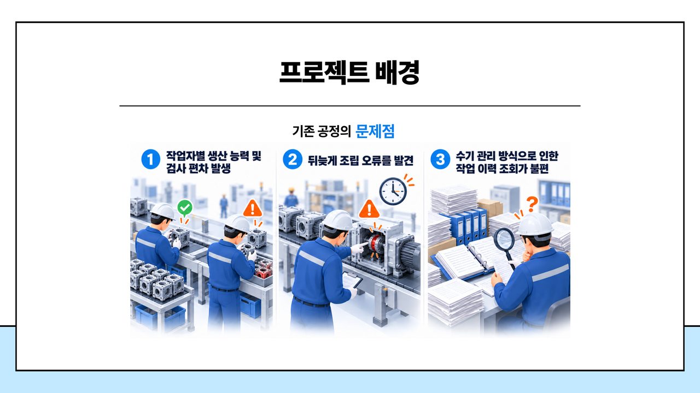

1. **작업자별 생산 능력 및 검사 편차 발생**:  
   작업자의 숙련도나 피로도에 따라 조립 속도와 검사의 엄격도가 달라져 품질 불균일이 발생합니다.
2. **뒤늦게 조립 오류를 발견**:  
   중간 단계의 결함(부품 누락, 오조립 등)을 즉시 인지하지 못하고 최종 완제품 검사 단계에서야 발견하여, 대규모 분해·재작업 비용과 자재 폐기 손실이 초래됩니다.
3. **수기 관리 방식으로 인한 작업 이력 조회가 불편**:  
   작업 일지, 불량 대장, 검사 결과를 수기로 작성하여 데이터가 누락되기 쉽고, 관리자가 실시간으로 공정 진행 상태와 품질 이상을 파악하기 어렵습니다.

### 1.2 프로젝트 목적

> **"조립 오류를 단계별로 즉시 확인하고, 모든 작업 이력을 데이터로 연결하여 생산 품질의 일관성을 극대화하며, 재작업 비용과 관리자의 확인 부담을 획기적으로 절감한다."**

### 1.3 프로젝트 목표

| 핵심 목표 | 상세 내용 |
|:---|:---|
| **AI 기반 조립 불량 검출** | 부품 누락(Missing), 오부품(Misplaced), 방향 오류 등 조립 불량을 단계별로 실시간 자동 인식 |
| **STEP별 조립 순서 및 위치 검증** | 제품 레시피(Recipe)에 정의된 순서와 상대 위치 좌표 허용 오차를 엄격히 판정 |
| **실시간 작업 현황 모니터링** | 작업자의 실시간 진행 상태(진행 STEP, 판정 결과, 일시정지, 불량)를 관제 센터로 즉시 집계 |
| **작업 이력 및 품질 데이터 통합 관리**| 작업 소요 시간, 일시정지 이력, 불량 유형, 검사 통계를 SQLite DB로 전산화하여 공정 병목 구간 분석 |

---

# 02. 시스템 설계 및 구현 (System Design & Implementation)

### 2.1 전체 시스템 아키텍처 및 흐름

하드웨어 제어기(STM32F411RE), 엣지 AI 작업자 단말(Jetson Orin Nano), 중앙 관제 PC가 상호 유기적으로 연동되는 분산 3계층 아키텍처입니다.

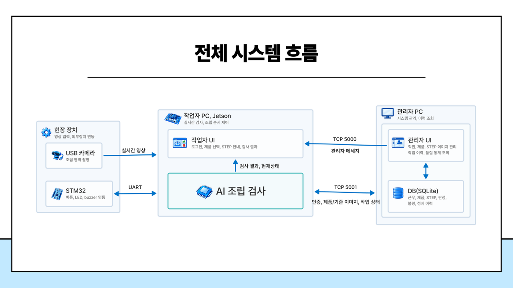

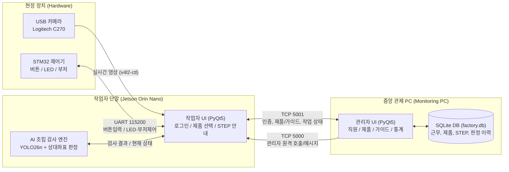
```mermaid
flowchart LR
    subgraph FIELD ["현장 장치 (Hardware)"]
        CAM["USB 카메라<br/>Logitech C270"]
        STM["STM32 제어기<br/>버튼 / LED / 부저"]
    end

    subgraph WORKER ["작업자 단말 (Jetson Orin Nano)"]
        WUI["작업자 UI (PyQt5)<br/>로그인 / 제품 선택 / STEP 안내"]
        AI["AI 조립 검사 엔진<br/>YOLO26n + 상대좌표 판정"]
    end

    subgraph ADMIN ["중앙 관제 PC (Monitoring PC)"]
        AUI["관리자 UI (PyQt5)<br/>직원 / 제품 / 가이드 / 통계"]
        DB[("SQLite DB (factory.db)<br/>근무, 제품, STEP, 판정 이력")]
    end

    CAM -->|"실시간 영상 (v4l2-ctl)"| WUI
    STM <-->|"UART 115200<br/>버튼입력 / LED·부저제어"| WUI
    AI <-->|"검사 결과 / 현재 상태"| WUI

    AUI -->|"TCP 5000<br/>관리자 원격 호출/메시지"| WUI
    WUI <-->|"TCP 5001<br/>인증, 제품/가이드, 작업 상태"| AUI
    AUI <--> DB
```

* **현장 장치**: 작업대 상단에 고정된 웹캠으로 조립 영역을 실시간 촬영하며, STM32의 물리 버튼으로 신속한 공정 입력(Start/Check/Pause/Reset)을 제공합니다.
* **작업자 단말 (Jetson Orin Nano)**: 작업자에게 현재 STEP의 기준 이미지와 실시간 영상을 비교 제공하며, 조립 완료 시 YOLO26n 기반 비전 검사 및 정합성 판정을 수행합니다.
* **중앙 관제 PC**: 실시간 작업 진행률, 검사 결과, 출퇴근 및 불량 이력을 수집하여 시각화하고, 필요 시 특정 작업자 단말로 긴급 호출 메시지를 푸시 전송합니다.

### 2.2 공정 상태 천이도 (FSM)

작업자 단말의 유한 상태 머신(Finite State Machine)은 조립 공정의 라이프사이클을 엄격하게 통제합니다.

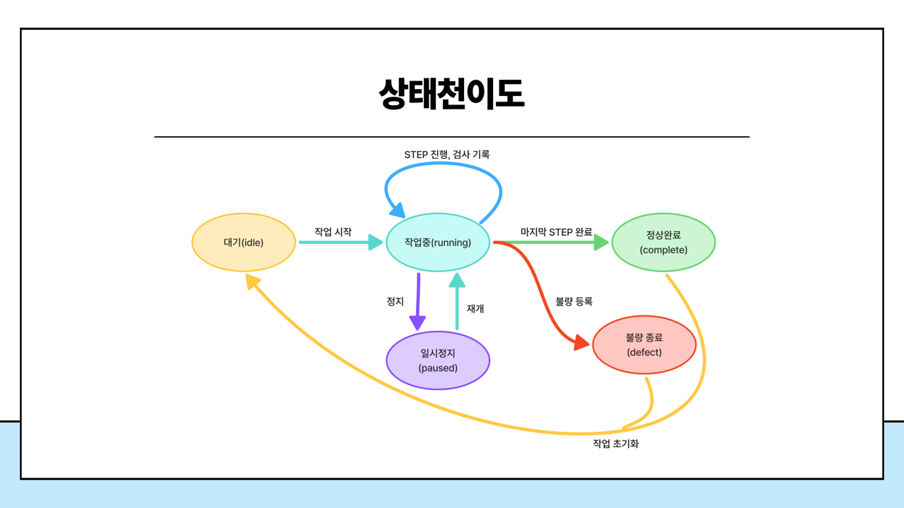

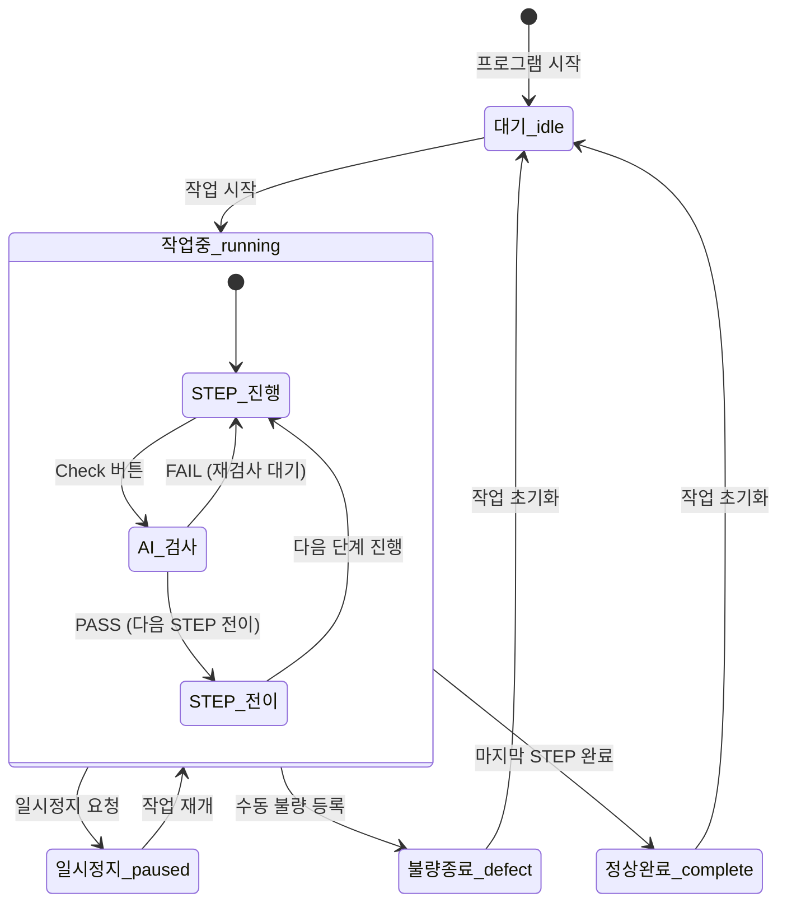
```mermaid
stateDiagram-v2
    [*] --> 대기_idle: 프로그램 시작
    대기_idle --> 작업중_running: 작업 시작
    
    state 작업중_running {
        [*] --> STEP_진행
        STEP_진행 --> AI_검사: Check 버튼
        AI_검사 --> STEP_진행: FAIL (재검사 대기)
        AI_검사 --> STEP_전이: PASS (다음 STEP 전이)
        STEP_전이 --> STEP_진행: 다음 단계 진행
    }
    
    작업중_running --> 일시정지_paused: 일시정지 요청
    일시정지_paused --> 작업중_running: 작업 재개
    
    작업중_running --> 불량종료_defect: 수동 불량 등록
    작업중_running --> 정상완료_complete: 마지막 STEP 완료
    
    정상완료_complete --> 대기_idle: 작업 초기화
    불량종료_defect --> 대기_idle: 작업 초기화
```

* **대기 (idle)**: 제품 선택 후 작업 대기 상태
* **작업중 (running)**: 각 STEP별 조립 진행 및 AI 비전 검사 반복 수행
* **일시정지 (paused)**: 화장실, 자재 수급 등으로 인한 작업 중단 (소요 시간 별도 누적)
* **정상완료 (complete)**: 제품의 모든 STEP을 완벽히 통과하여 완제품 등록
* **불량종료 (defect)**: 부품 파손 등으로 공정 진행 불가 시 불량 사유를 기록하고 작업 종료

### 2.3 하드웨어 부품 목록 (Part List)

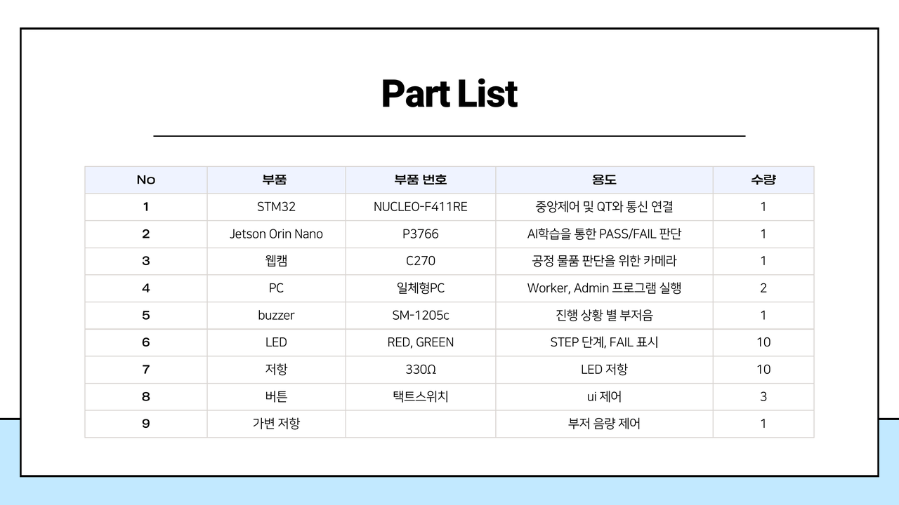

| No | 부품명 | 모델/규격 | 용도 및 역할 | 수량 |
|:---:|:---|:---|:---|:---:|
| 1 | **STM32** | NUCLEO-F411RE | 중앙 제어, 물리 I/O 처리 및 작업자 단말과의 UART 통신 | 1 |
| 2 | **Jetson Orin Nano** | P3766 | AI 모델 추론, 공정 상태 머신 제어, 작업자 GUI 구동 | 1 |
| 3 | **웹캠** | Logitech C270 | 720p 30fps 공정 조립 영역 실시간 촬영 | 1 |
| 4 | **PC** | 일체형 PC | Worker(작업자) 및 Admin(중앙 관제) 프로그램 실행 | 2 |
| 5 | **Buzzer** | SM-1205c | 공정 진행 상황별 맞춤형 7종 부저음 출력 | 1 |
| 6 | **LED** | 5mm RED / GREEN | STEP 1~9 진행 상태(초록) 및 FAIL 결함 경보(빨강) 표시 | 10 |
| 7 | **저항** | 330Ω | LED 전류 제한 및 회로 보호 저항 | 10 |
| 8 | **버튼** | 택트 스위치 | 작업 시작, AI 검사, 일시정지/재개, 초기화 물리 입력 | 4 |
| 9 | **가변 저항** | 10kΩ Potentiometer | 피에조 부저 알림 음량 하드웨어 미세 조절 | 1 |

### 2.4 하드웨어 회로도 (Schematic)

STM32F411RE의 GPIO 및 타이머 자원을 효율적으로 배분하여 안정적인 현장 제어를 구축했습니다.

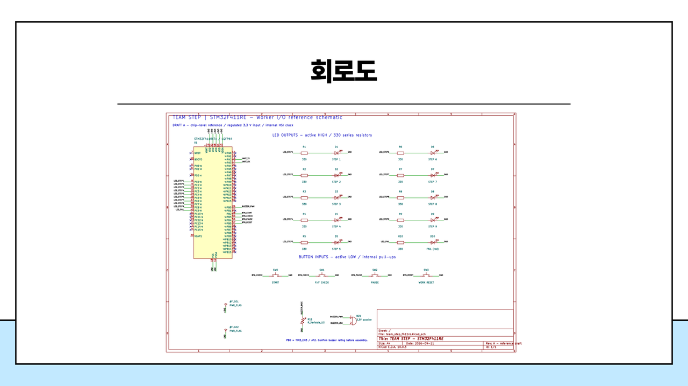

* **LED 출력 (Active HIGH / 330Ω 직렬 연결)**:
  * `PC0` ~ `PC8` : STEP 1 ~ STEP 9 단계 표시 녹색 LED
  * `PC9` : FAIL 경보 적색 LED
* **버튼 입력 (Active LOW / STM32 내부 풀업 저항 활성화)**:
  * `PB2` : `BTN_START` (작업 시작)
  * `PB3` : `BTN_CHECK` (AI 비전 검사 요청)
  * `PB4` : `BTN_PAUSE` (작업 일시정지 / 재개 토글)
  * `PB5` : `BTN_RESET` (수동 불량 처리 및 초기화)
* **부저 출력 (TIM3_CH3 PWM)**:
  * `PB0` : 하드웨어 타이머 PWM 주파수 제어로 옥타브별 멜로디 연주 및 가변저항 볼륨 조정
* **UART 통신**:
  * `PA2` (USART2_TX), `PA3` (USART2_RX) : 115,200 bps 보드레이트로 Jetson과 전이중 시리얼 통신

### 2.5 데이터베이스 설계 (ERD)

공정 이력의 완벽한 추적성과 데이터 무결성을 보장하는 SQLite 기반 정규화 관계형 데이터베이스입니다.

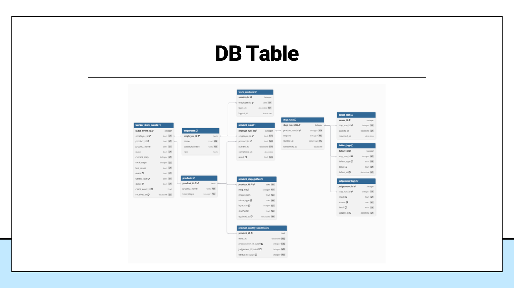

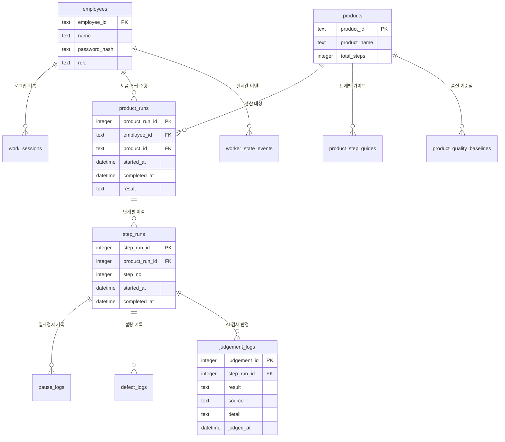
```mermaid
erDiagram
    employees ||--o{ work_sessions : "로그인 기록"
    employees ||--o{ product_runs : "제품 조립 수행"
    products ||--o{ product_runs : "생산 대상"
    products ||--o{ product_step_guides : "단계별 가이드"
    products ||--o{ product_quality_baselines : "품질 기준점"
    product_runs ||--o{ step_runs : "단계별 이력"
    step_runs ||--o{ pause_logs : "일시정지 기록"
    step_runs ||--o{ defect_logs : "불량 기록"
    step_runs ||--o{ judgement_logs : "AI 검사 판정"
    employees ||--o{ worker_state_events : "실시간 이벤트"

    employees {
        text employee_id PK
        text name
        text password_hash
        text role
    }
    products {
        text product_id PK
        text product_name
        integer total_steps
    }
    product_runs {
        integer product_run_id PK
        text employee_id FK
        text product_id FK
        datetime started_at
        datetime completed_at
        text result
    }
    step_runs {
        integer step_run_id PK
        integer product_run_id FK
        integer step_no
        datetime started_at
        datetime completed_at
    }
    judgement_logs {
        integer judgement_id PK
        integer step_run_id FK
        text result
        text source
        text detail
        datetime judged_at
    }
```

* **`employees`**: 작업자 및 관리자 계정, 권한 관리
* **`work_sessions`**: 작업자의 출근, 퇴근 및 실근무 시간 기록
* **`products`**: 생산 대상 레시피 마스터 (제품명, 총 STEP 수)
* **`product_runs`**: 제품 1개 단위의 조립 세션 및 최종 결과 (정상 완료 / 불량 종료)
* **`step_runs`**: 제품 내 각 STEP별 시작/종료 시점 및 소요 시간
* **`pause_logs`**: 작업자가 일시정지한 구간의 시작/재개 시각 및 누적 정지 시간
* **`defect_logs`**: 수동 불량 등록 시 발생 STEP 및 상세 결함 사유
* **`judgement_logs`**: AI 비전 판정(PASS/FAIL) 결과, 부품별 정합성 오차 상세 데이터
* **`worker_state_events`**: 작업자 단말에서 전송된 원본 상태 변경 시계열 이벤트
* **`product_step_guides`**: 단계별 작업자용 표준 가이드 이미지 파일 경로 및 해시값
* **`product_quality_baselines`**: 품질 통계 집계 초기화 기준점 (Cutoff 관리)

### 2.6 시스템 시연 영상 (Demo Video)

스마트 팩토리 조립 공정 모니터링 시스템(작업자 단말 및 중앙 관제)의 실제 구동 및 연동 시연 영상입니다. 아래 썸네일 또는 링크를 클릭하면 YouTube 영상으로 바로 연결됩니다.

<div align="center">

[](https://youtu.be/gZJ9jKR4R3w)

[](https://youtu.be/gZJ9jKR4R3w)

> 📺 **시연 영상 링크**: [https://youtu.be/gZJ9jKR4R3w](https://youtu.be/gZJ9jKR4R3w)  
> *STM32 하드웨어 버튼 입력 → Jetson Orin Nano AI 실시간 조립 검사(PASS/FAIL) → 중앙 관제 PC 실시간 모니터링 및 작업자 호출 연동*

</div>

---

# 03. 핵심 기술 (Core Technologies - AI & Vision)

### 3.1 AI의 역할 및 조립 검사 프로세스

비전 AI는 단순한 불량 분류에 그치지 않고, 제품의 현재 조립 상태를 계측하여 조립 순서 제어(FSM)와 연동됩니다.

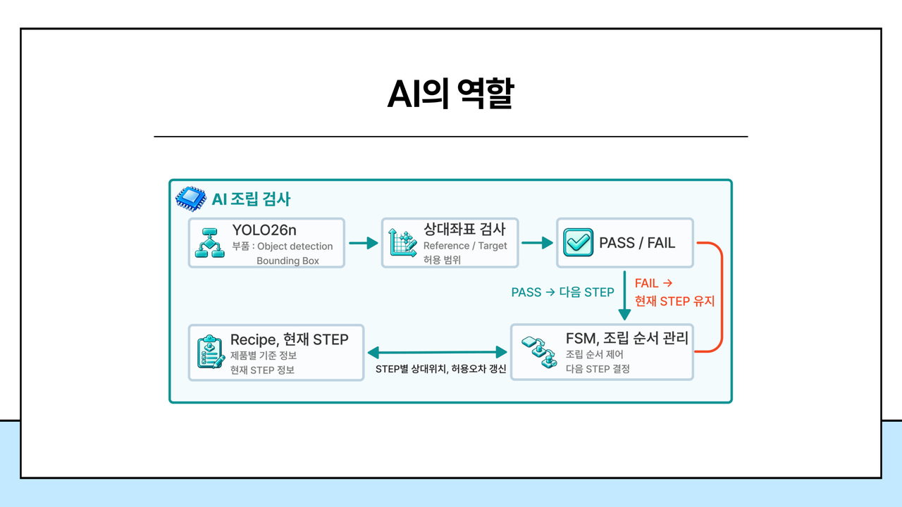

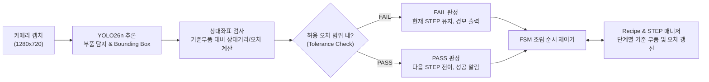
```mermaid
flowchart LR
    A["카메라 캡처<br/>(1280x720)"] --> B["YOLO26n 추론<br/>부품 탐지 & Bounding Box"]
    B --> C["상대좌표 검사<br/>기준부품 대비 상대거리/오차 계산"]
    C --> D{"허용 오차 범위 내?<br/>(Tolerance Check)"}
    D -->|"FAIL"| E["FAIL 판정<br/>현재 STEP 유지, 경보 출력"]
    D -->|"PASS"| F["PASS 판정<br/>다음 STEP 전이, 성공 알림"]
    E --> G["FSM 조립 순서 제어기"]
    F --> G
    G <--> H["Recipe & STEP 매니저<br/>단계별 기준 부품 및 오차 갱신"]
```

1. **객체 검출 (Object Detection)**: YOLO26n 신경망을 통해 영상 내 조립 부품들을 실시간 검출하고 Bounding Box 좌표를 획득합니다.
2. **상대좌표 검사 (Relative Coordinate Verification)**: 조립 베이스가 되는 **기준 부품(Reference Part)**을 축으로 삼아, 현재 단계에서 조립되어야 할 **목표 부품(Target Part)**의 상대 거리(dx, dy)와 배치를 레시피 허용 오차와 비교합니다. (카메라와 제품의 위치가 미세하게 틀어져도 정밀 판정 가능)
3. **PASS / FAIL 판정**: 모든 부품이 정확한 위치에 조립되었으면 PASS, 부품 누락이나 위치 이탈 발생 시 세부 사유와 함께 FAIL을 판정합니다.
4. **FSM 동기화**: 판정 결과는 공정 상태 머신에 즉시 반영되어 다음 단계 가이드를 로드하거나 재검사를 대기합니다.

### 3.2 모델 선정 근거 (Why YOLO26n?)

검사에 필요한 본질적인 정보는 **"어떤 부품이, 몇 개, 어디에 있는가"**입니다.

| 비교 항목 | Classification (분류) | Segmentation (분할) | Object Detection (객체 검출 - 선정) |
|:---|:---|:---|:---|
| **제공 정보** | 이미지 전체에 대한 단일 클래스 라벨 | 부품의 픽셀 단위 마스크 및 윤곽선 | **부품 종류(Class) + Bounding Box 좌표** |
| **장점 및 한계** | 전체 불량 여부는 알 수 있으나, **개별 부품의 개수 및 상대 위치 파악 불가 ❌** | 윤곽선이 정밀하나 공정 검사 대비 연산량이 과도하고 **라벨링 비용이 극도로 높음 ❌** | **부품 개수와 상대 좌표 검사에 필요한 필수 정보를 최소 라벨링 비용으로 완벽 제공 ⭕** |
| **선정 이유** | 정보 부족으로 탈락 | 비효율적 리소스 소모로 탈락 | **작은 조립 부품 검출 특화 + Jetson Orin Nano 실시간 구동을 위한 극대화된 경량화 (YOLO26n)** |

### 3.3 모델 학습 설계 및 실험 가설

현장 적용 시 가장 중요한 과제는 **"신규 제품 레시피가 추가될 때마다 요구되는 데이터 촬영 및 라벨링 공수를 어떻게 최소화할 것인가?"**였습니다.

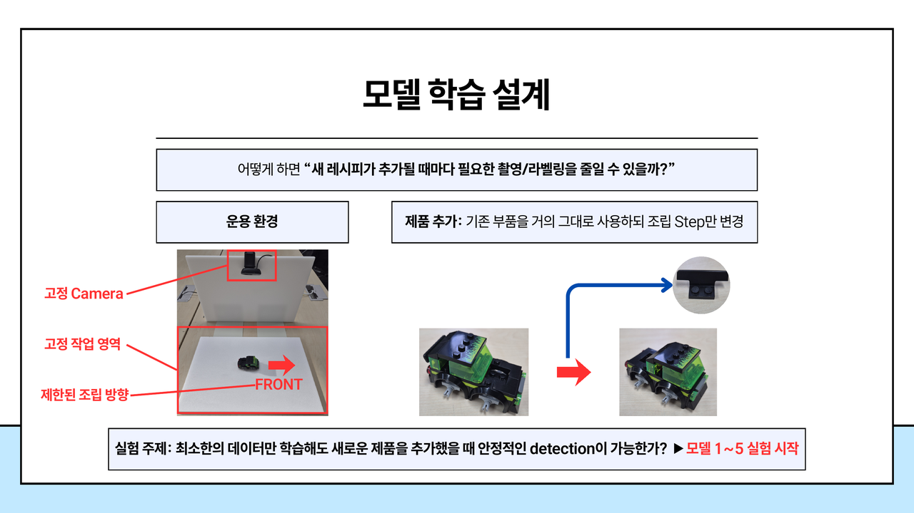

* **운용 환경 제약 조건**:
  * 고정 카메라 (Logitech C270)
  * 고정된 작업 영역 (Working Zone)
  * 일관된 조립 방향 (FRONT 전면 지향)
* **제품 구성 특성**:
  * 신규 제품(Recipe 2)은 기존 부품 풀을 대부분 재활용하며, 조립되는 STEP 순서와 일부 부품만 달라짐
* **핵심 가설**:
  > *"모든 제품을 처음부터 전수 촬영하지 않고, 최소한의 변경 데이터만으로도 신규 제품 추가 시 안정적인 검출 성능을 확보할 수 있는가?"*

### 3.4 평가 데이터셋 및 평가 지표

* **Dataset 1 - Recipe Test (정상 공정 검증용)**:
  * Recipe 1·2의 STEP별 정상 조립 이미지 5장씩, **총 50장** (Recipe 1: 6 Steps, Recipe 2: 추가 4 Steps)
* **Dataset 2 - Generalization Test (일반화 및 결함 검증용)**:
  * 작업자가 현장에서 저지를 수 있는 실수, 부품 위치 편차, 오배치 케이스 **총 18장**
* **평가 지표**:
  * **Precision (정밀도)**: 모델이 검출한 부품 중 실제 정답 부품의 비율 → **오검출(False Positive) 방지 확인**
  * **Recall (재현율)**: 실제 존재하는 부품 중 모델이 찾아낸 비율 → **미검출(False Negative) 방지 확인**
  * **mAP@50**: IoU 0.5 기준 전 클래스 평균 검출 정확도

### 3.5 모델 점진적 개선 실험 (Model 1 ~ Model 5)

데이터 구축 전략에 따라 5단계의 점진적 모델 실험을 수행했습니다.


```mermaid
flowchart LR
    M1["Model 1<br/>기준 모델<br/>(Recipe 1만 학습)"] -->|"Single 부품 이미지 추가"| M2["Model 2<br/>부품 단독 학습<br/>(오검출 완화 시도)"]
    M2 -->|"Recipe 2 변경 STEP 추가"| M3["Model 3<br/>신규 STEP 타겟 학습<br/>(mAP 대폭 향상)"]
    M3 -->|"좌우 반전 증강"| M4["Model 4<br/>Horizontal Flip<br/>(추가 촬영 없이 일반화)"]
    M4 -->|"Single 데이터 제거"| M5["Model 5<br/>조립 STEP 중심 최적화<br/>(최종 채택)"]
```

#### 실험 결과 요약표

| 모델 단계 | 주요 학습 구성 | Recipe Test (mAP50) | Generalization (Precision) | Generalization (Recall) | Generalization (mAP50) | 비고 및 평가 |
|:---|:---|:---:|:---:|:---:|:---:|:---|
| **Model 1** | Train 60장 / Val 30장 (Recipe 1 기준) | 92.8% | 76.2% | 83.1% | 83.0% | 일반화 시 Precision 15.7% 급감 (오검출 다수 발생) |
| **Model 2** | Train 72장 (+Single 부품별 이미지 추가) | 91.4% | 80.7% (+4.5%) | 78.0% (-5.1%) | 79.7% (-3.3%) | 단독 부품 추가로 정밀도는 상승했으나 실제 결합 환경 재현율 저하 |
| **Model 3** | Train 92장 (+Recipe 2 변경 4 STEP 추가) | **99.5% (+8.1%)** | 84.8% | 88.8% | **90.7% (+11.0%)** | 신규 레시피의 변경 STEP을 타겟 보강하여 성능 대폭 반등 |
| **Model 4** | Model 3 데이터 + Horizontal Flip 좌우 반전 | 81.5% (mAP50-95) | 87.8% (+3.0%) | 89.3% | 69.0% (mAP50-95) | 추가 촬영 비용 없이 데이터 증강만으로 일반화 정밀도 향상 |
| **Model 5 (최종)**| **Single 데이터 제거 + 실제 조립 STEP 중심 최적화** | **99.5%** | **88.1%** | **95.5% (+6.2%)** | **92.9% (+23.9%)** | **불필요 노이즈 제거로 최고 검출 성능 및 일반화 달성** |

### 3.6 취약 부품 개선 사례 (rear_spoiler 오검출 해결)

* **문제 현상**:  
  조립 부품 중 `rear_spoiler`는 일반화 테스트에서 **Precision 49.2%, mAP50 49.7%**로 오검출이 심각하게 발생했습니다.
* **대응 전략**:  
  전체 공정을 재촬영하는 비효율을 배제하고, **"해당 부품이 실제로 등장하는 특정 STEP 중심"**으로 타겟 데이터를 집중 수집하여 재학습을 진행했습니다.
* **지속적 모델 개선 루프 (Data Flywheel)**:
  > 🔄 **공정 운영** ➔ **FAIL 케이스 수집** ➔ **취약 Class & STEP 분석** ➔ **타겟 데이터 추가** ➔ **재학습** (선순환 피드백 루프)

### 3.7 최종 데이터 구축 및 학습 전략

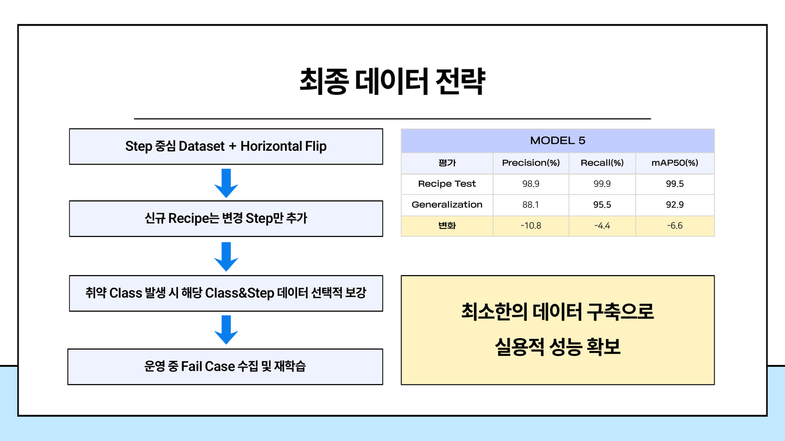

1. **조립 STEP 중심 데이터셋 구성**: 단독 부품 이미지는 배제하고 실제 결합 맥락이 담긴 STEP 이미지 위주로 데이터셋 구축
2. **Horizontal Flip 증강 적극 활용**: 추가 물리 촬영 공수 없이 좌우 반전 증강을 적용하여 다양한 조립 각도 대응
3. **선택적 차분 학습 (Delta Learning)**: 신규 레시피 도입 시 기존과 달라지는 변경 STEP 이미지만 추가 수집
4. **결과**: **최소한의 데이터 라벨링 구축 비용으로 실용적 현장 검출 성능(mAP 99.5% / 일반화 92.9%) 확보 성공**

---

# 04. 시스템 기능 및 통신 프로토콜 (System Functions & Communications)

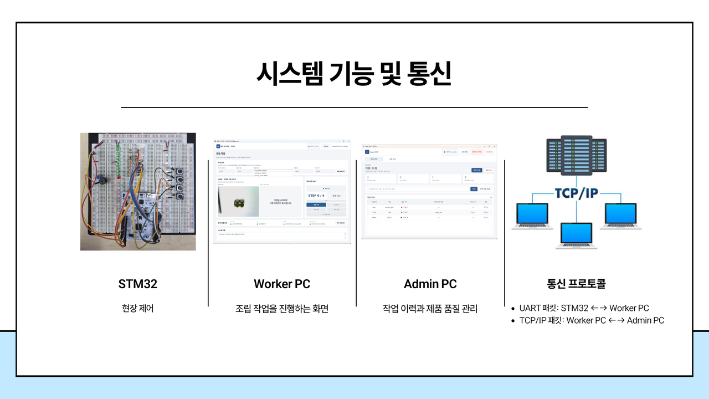

### 4.1 작업자 단말 (Worker PC / Jetson Orin Nano)

현장 작업자가 조립을 진행하며 실시간 피드백을 받는 전용 터치/모니터 인터페이스입니다.

#### ① 기본 작업 인터페이스 및 실시간 가이드
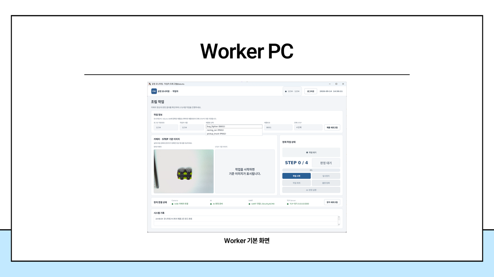
* **작업 정보 패널**: 작업자 사번/이름, 생산 제품 선택(Dropdown: `bug_fighter`, `racing_car`, `pickup_truck`), 총 STEP 수 표시
* **듀얼 뷰어**: 실시간 카메라 영상 뷰와 관리자가 등록한 해당 STEP 표준 가이드 이미지를 나란히 배치하여 작업자의 육안 비교 지원
* **상태 인디케이터**: 공정 진행률 Bar, 현재 STEP 번호, 장치 상태(Camera, AI, UART, TCP Server) 실시간 LED 램프 제공

#### ② AI 판정 결과 팝업 (FAIL / PASS / COMPLETE)
| FAIL 판정 (Slide 35) | PASS 판정 (Slide 36) | COMPLETE 완료 (Slide 37) |
|:---:|:---:|:---:|
| 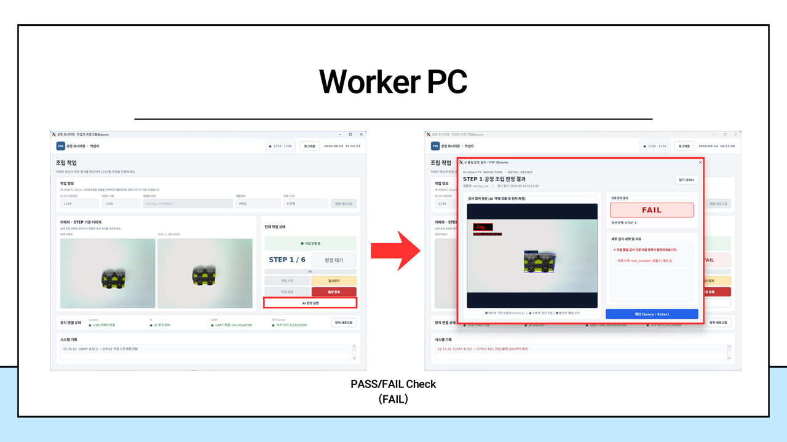 | 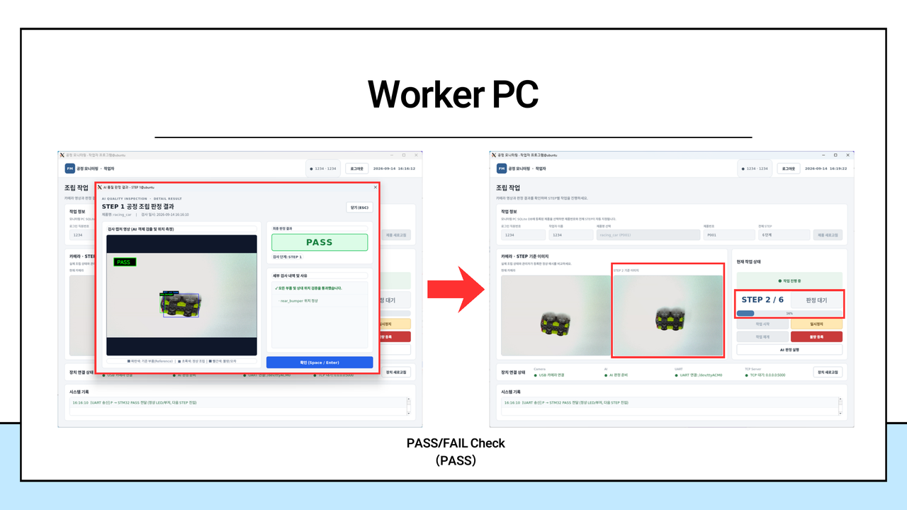 | 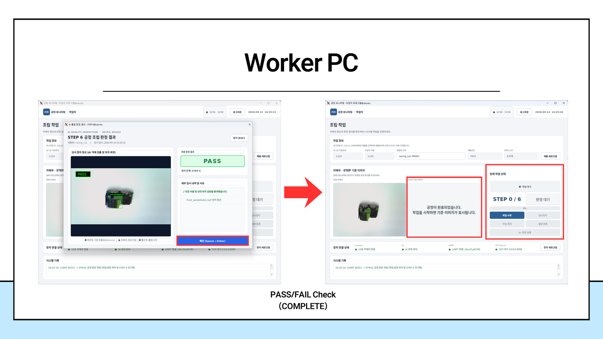 |
| **부품 누락/오조립 검출**<br/>- 결함 사유 명시 (`부품 누락: rear_bumper`)<br/>- FAIL 경보음 및 빨간색 LED 점등<br/>- 현재 단계 유지 및 재검사 대기 | **정상 조립 통과**<br/>- Bounding Box 정상 표시<br/>- PASS 멜로디 및 다음 STEP 녹색 LED 점등<br/>- 다음 STEP 기준 가이드 이미지 자동 전환 | **전체 제품 조립 완료**<br/>- 제품의 모든 STEP 정상 검증 통과<br/>- 축하 팡파레 부저음 출력<br/>- 관제 서버 완료 보고 후 0단계 자동 복귀 |

#### ③ 장애 대응 및 작업 자동 복구 (Fault Tolerance)
| 장치 연결 상태 감지 (Slide 38) | 작업 기록 자동 복구 (Slide 39) |
|:---:|:---:|
| 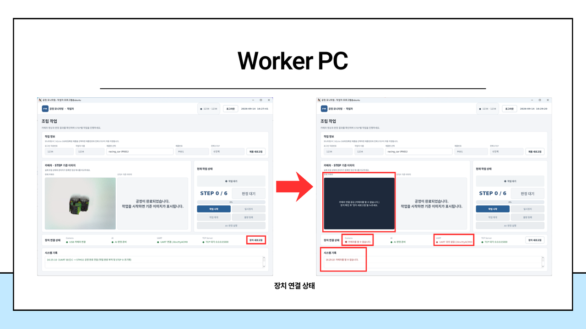 | 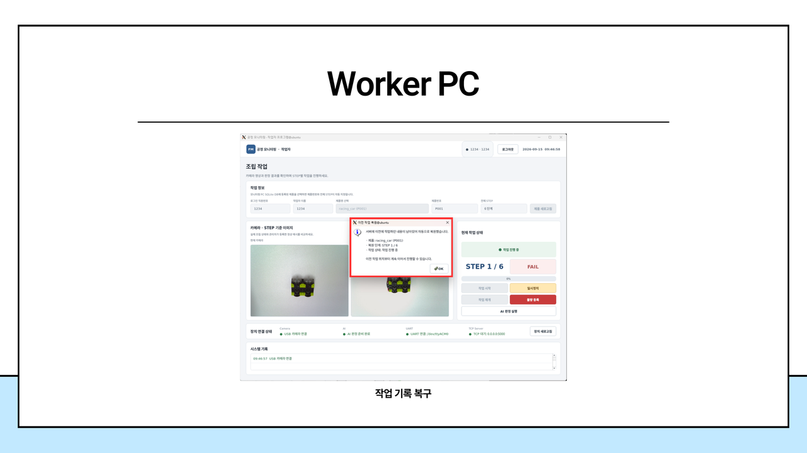 |
| **장치 이상 감지 및 무중단 재연결**<br/>- 카메라 분리, UART 시리얼 두절 시 즉각 붉은 경고 표시<br/>- 프로그램 재시작 없이 [장치 새로고침]을 통한 핫플러그 무중단 재연결 | **비정상 종료 시 세션 자동 복원**<br/>- PC 전원 차단, 강제 종료 후 재로그인 시 관제 DB 동기화<br/>- 이전 미완료 작업(제품, 진행 STEP, 일시정지 상태) 완벽 복원 |

---

### 4.2 현장 제어기 (STM32F411RE)

조립 작업자가 장갑을 낀 상태에서도 마우스나 키보드 없이 직관적으로 조작할 수 있는 물리 하드웨어 컨트롤러입니다.

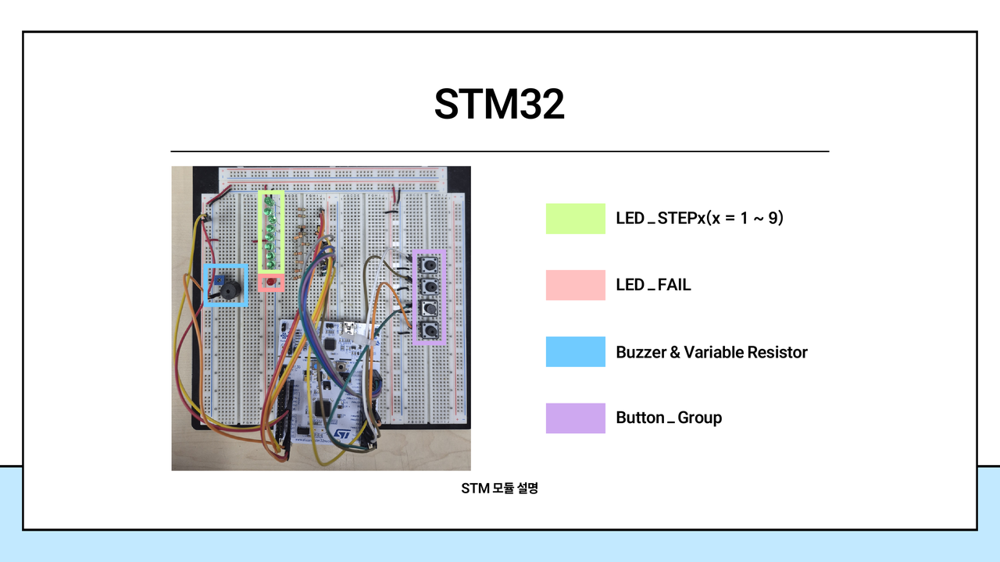

1. **LED_STEPx (x = 1 ~ 9)**: 초록색 LED 9개로 현재 작업자가 수행 중인 STEP을 시각적으로 직관 표시
2. **LED_FAIL**: 검사 불량 발생 시 점등되는 고휘도 적색 경보 LED
3. **Buzzer & Variable Resistor**:
   * 시끄러운 공장 환경에서도 식별 가능한 7종 전용 부저 멜로디 (시작, PASS, FAIL, 일시정지, 재개, 불량, 전체완료)
   * 현장 소음도에 따라 볼륨을 조절할 수 있는 가변 저항(Potentiometer) 탑재
4. **Button_Group (4종 물리 버튼)**:
   * **Start**: 제품 선택 후 공정 시작 요청
   * **P/F Check**: 조립 완료 후 AI 비전 검사 실행 요청
   * **Pause**: 작업 일시정지 및 재개 토글 요청
   * **Work Reset**: 부품 결함 발생 시 수동 불량 처리 요청

---

### 4.3 중앙 관제 시스템 (Monitoring PC / Admin)

공장 전체의 생산 라인, 작업자 출결, 제품 레시피, 품질 통계를 총괄 관리하는 관리자용 데스크톱 시스템입니다.

#### ① 직원 관리 및 실시간 현황 조회
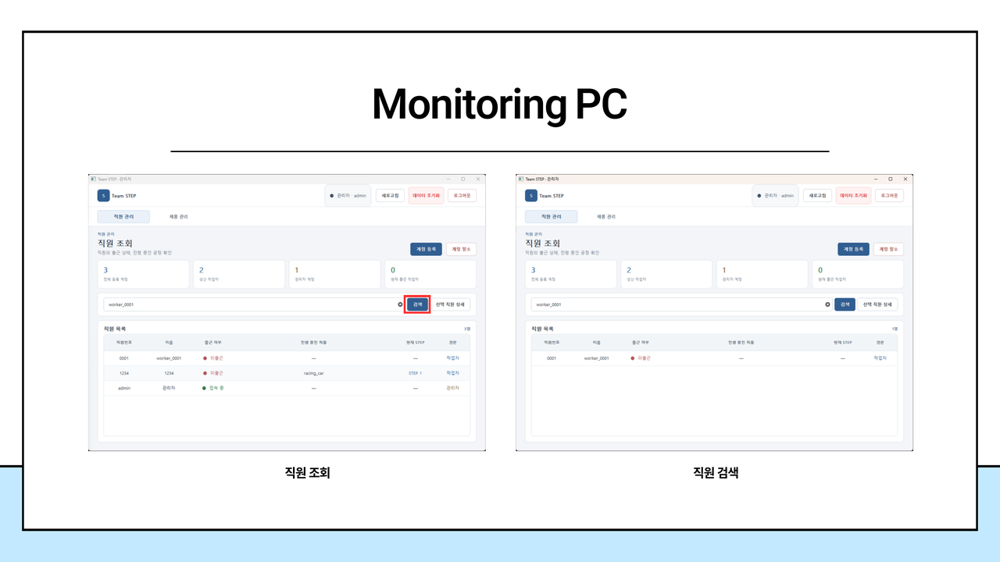
* **작업자 계정 관리**: 신규 작업자 등록, 퇴사자 계정 말소, 비밀번호 관리
* **실시간 근무 대시보드**: 등록 계정 수, 현재 출근자 수, 작업 진행자 수, 담당 제품 및 진행 STEP 실시간 현황 요약

#### ② 작업자 상세 이력 관리
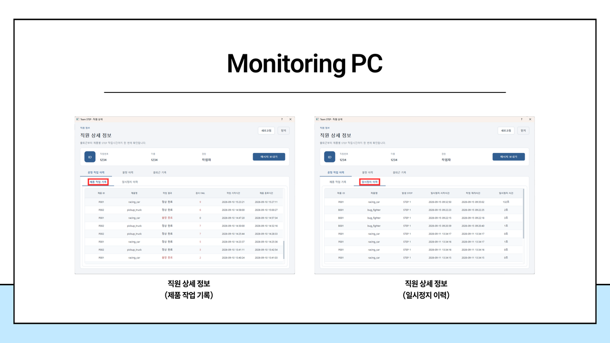
* **제품 작업 기록**: 사원별 작업 제품, 최종 결과(정상 완료/불량 종료), 총 검사 FAIL 횟수, 시작/종료 시각
* **일시정지 이력**: 발생 STEP, 정지 시작 시각, 재개 시각, 누적 일시정지 시간(초) 상세 추적
* **불량 및 출퇴근 기록**: 수동 불량 등록 사유 및 일자별 로그인/로그아웃 시간 기반 근태 자동 판정

#### ③ 실시간 작업자 원격 호출 (메시지 푸시)
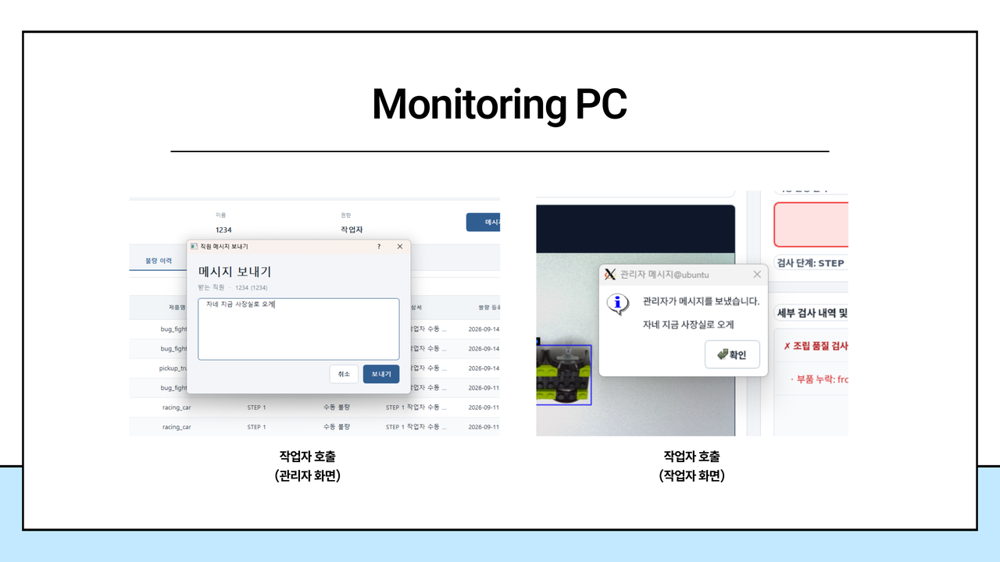
* 관리자 화면에서 특정 작업자를 선택하고 메시지를 작성하여 전송하면, 해당 작업자의 Jetson 화면에 TCP 5000 포트를 통해 모달 팝업으로 즉각 표시됩니다.

#### ④ 제품 레시피 및 STEP별 품질 상세 통계
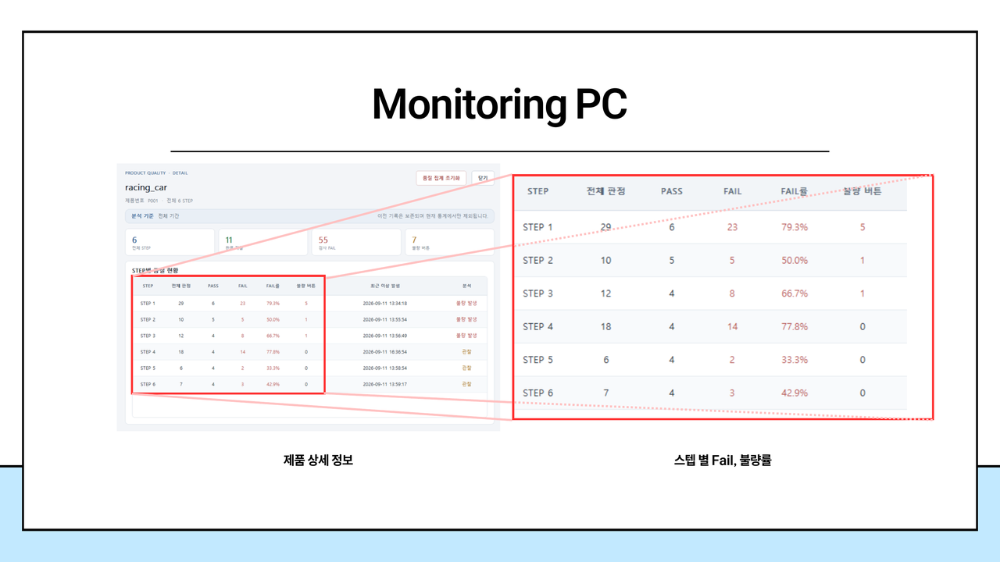
* **레시피 관리**: 신규 제품 등록, 제품 삭제, STEP별 표준 가이드 이미지 등록 및 수정
* **STEP별 품질 분석 테이블**:
  * 각 STEP별 **전체 판정 수, PASS 수, FAIL 수, FAIL률(%), 불량 버튼 클릭 횟수** 자동 집계
  * 품질 취약 STEP을 직관적으로 도출하여 작업자 재교육 또는 부품 설계 개선 근거로 활용

---

### 4.4 통신 프로토콜 규격 (TCP/IP & UART)

#### ① TCP/IP 네트워크 통신 (Worker ⟷ Admin)
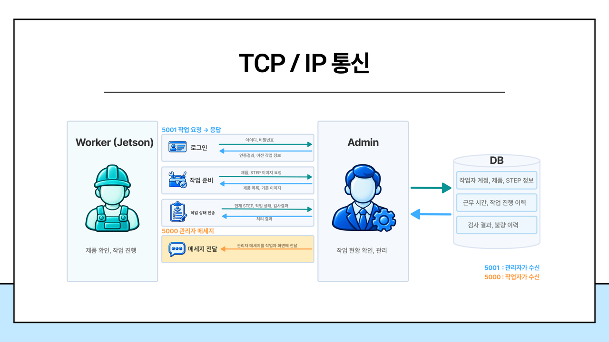

* **Port 5001 (동기식 업무 요청 및 상태 보고)**:
  * **로그인 요청**: Worker → `{"type": "LOGIN", "employee_id": "1001", "password": "..."}` → Admin
  * **로그인 응답**: Admin → `{"success": true, "session_token": "...", "unfinished_work": {...}}` → Worker
  * **제품 및 가이드 요청**: Worker → `{"type": "GET_PRODUCT_LIST"}` / `{"type": "GET_GUIDE_IMAGE", "step": 1}`
  * **상태 보고 (Heartbeat & Result)**: Worker → `{"type": "STATE_UPDATE", "step": 2, "state": "RUNNING", "result": "PASS"}`
* **Port 5000 (관리자 비동기 메시지 푸시)**:
  * Admin → `{"type": "ADMIN_MESSAGE", "message": "관리자가 호출하였습니다."}` → Worker (UTF-8 인코딩)

#### ② UART 시리얼 통신 (STM32 ⟷ Jetson)
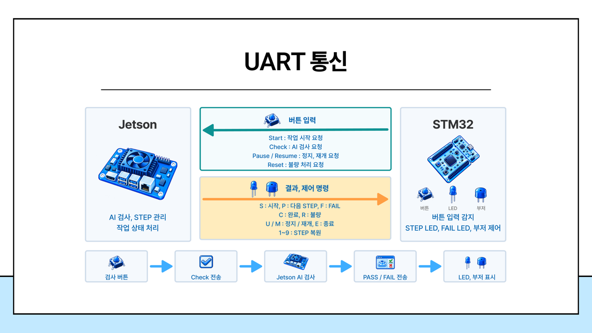

* **전송 규격**: Baud Rate `115,200 bps`, Data `8-bit`, Parity `None`, Stop `1-bit`

| 방향 | 패킷 / 명령어 | 의미 및 설명 |
|:---:|:---:|:---|
| **STM32 → Jetson**<br/>(물리 버튼 이벤트) | `Start\n` | 작업자가 시작 버튼(PB2)을 눌러 공정 시작을 요청함 |
| | `Check\n` | 작업자가 검사 버튼(PB3)을 눌러 현재 STEP AI 검사를 요청함 |
| | `Pause\n` / `Resume\n` | 작업자가 정지 버튼(PB4)을 눌러 일시정지 또는 재개를 요청함 |
| | `Reset\n` | 작업자가 리셋 버튼(PB5)을 눌러 수동 불량 처리를 요청함 |
| **Jetson → STM32**<br/>(하드웨어 제어 명령) | `'S'` | 공정 시작 확인: STEP 1 LED 점등 및 시작 부저음 출력 |
| | `'P'` | 검사 PASS: 다음 STEP LED 점등 및 PASS 멜로디 재생 |
| | `'F'` | 검사 FAIL: FAIL 경보 LED 점등 및 FAIL 경보 부저음 재생 |
| | `'C'` | 공정 완료: 전체 완료 축하 팡파레 재생 후 0단계 대기로 복귀 |
| | `'R'` | 불량 초기화: 불량 경보음 재생 후 0단계 대기로 복귀 |
| | `'U'` / `'M'` | 일시정지(`'U'`) 및 재개(`'M'`) 알림음 출력 |
| | `'E'` | 세션 종료 / 대기: 모든 LED 소등 및 버튼 인터럽트 비활성화 |
| | `'1'` ~ `'9'` | 미완료 작업 복원: 해당 STEP 번호의 LED 즉시 직접 점등 |

---

# 05. 결론 및 기대효과 (Conclusion & Review)

### 5.1 시스템 도입 기대 효과

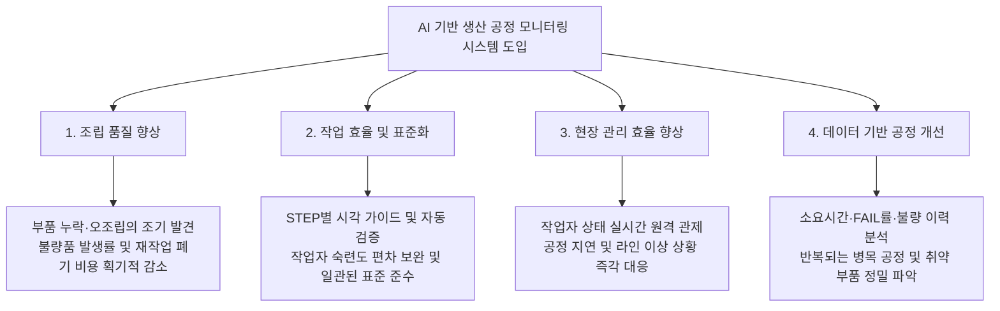
```mermaid
flowchart TD
    A["AI 기반 생산 공정 모니터링 시스템 도입"]
    A --> B["1. 조립 품질 향상"]
    A --> C["2. 작업 효율 및 표준화"]
    A --> D["3. 현장 관리 효율 향상"]
    A --> E["4. 데이터 기반 공정 개선"]

    B --> B1["부품 누락·오조립의 조기 발견<br/>불량품 발생률 및 재작업 폐기 비용 획기적 감소"]
    C --> C1["STEP별 시각 가이드 및 자동 검증<br/>작업자 숙련도 편차 보완 및 일관된 표준 준수"]
    D --> D1["작업자 상태 실시간 원격 관제<br/>공정 지연 및 라인 이상 상황 즉각 대응"]
    E --> E1["소요시간·FAIL률·불량 이력 분석<br/>반복되는 병목 공정 및 취약 부품 정밀 파악"]
```

### 5.2 팀원별 프로젝트 느낀 점 및 기술적 성취

<details open>
<summary><b>💬 Team STEP 구성원들의 개발 회고</b></summary>

* **고지현**:  
  > *"무조건 파라미터가 많고 성능이 좋은 거대 AI 모델을 고집하는 것보다, 실제 엣지 디바이스의 제한된 연산 자원과 사용 용도에 부합하는 적절한 모델을 선정하는 것이 속도와 경량화 측면에서 훨씬 유리함을 체감했습니다. STM32 펌웨어 개발에서는 타이머 인터럽트로 딜레이와 음향을 처리할 때 버튼 디바운싱(Debouncing), 상태 인터록(Interlock), 플래그 제어를 철저히 설계해야 오동작이 없다는 귀중한 교훈을 얻었습니다."*

* **박상현**:  
  > *"카메라 실시간 스트리밍, 딥러닝 추론, 네트워크 통신이 복합적으로 작동할 때 발생하는 UI 프리징 현상을 PyQt5의 멀티스레딩(QThread) 아키텍처로 분리하여 완전히 해결했습니다. 또한 조도 변화로 인한 비전 인식 오류를 리눅스 v4l2-ctl 하드웨어 제어로 직접 보정하면서, 단순한 애플리케이션 코딩을 넘어 운영체제와 디바이스 드라이버를 아우르는 시스템 엔지니어링 시야를 넓힐 수 있었습니다."*

* **김선호**:  
  > *"중앙 모니터링 GUI와 TCP/IP 소켓 통신, SQLite DB를 구축하며 현장의 작업자 상태가 관제 화면에 실시간으로 일관되게 전달되는 전체 파이프라인을 깊이 이해할 수 있었습니다. 특히 네트워크 지연 시 데이터가 중복 집계되는 이슈를 해결하면서, 통신이란 단순히 패킷을 보내는 것뿐만 아니라 수신된 데이터의 무결성과 상태 정합성을 철저히 검증하고 처리하는 것이 핵심임을 배웠습니다."*

* **윤홍은**:  
  > *"AI 모델 자체의 벤치마크 점수뿐만 아니라, 현장 작업 영역의 촬영 환경 통제, 데이터셋 구성 전략, 그리고 부품 간 상대좌표 오차를 계산하는 비즈니스 판정 로직까지 시스템 전체가 유기적으로 맞물려야만 비로소 실용적인 품질 검사가 완성된다는 점을 배웠습니다."*

</details>

---

# 06. 빠른 시작 가이드 (Quick Start)

> [!IMPORTANT]
> **모든 실행 명령어는 반드시 프로젝트 최상위 루트 디렉토리(`AI_Standard_Process_System/`)에서 수행해야 합니다.**  
> 하위 폴더로 이동하여 실행하지 마십시오.

### 6.1 중앙 관제 PC 실행 (Windows)

가상환경(`.venv`) 자동 생성 및 의존성 패키지가 자동 동기화되므로 루트 스크립트만 실행하면 됩니다.

* **CMD (명령 프롬프트)**:
  ```cmd
  .\run_admin.bat
  ```
* **PowerShell**:
  ```powershell
  .\run_admin.ps1
  ```

### 6.2 작업자 단말 실행 (Jetson Orin Nano / Linux)

UART 권한(`dialout` udev 규칙), 카메라 유틸리티(`v4l-utils`), Python 가상환경이 자동 구성된 후 실행됩니다.

```bash
bash run_worker.sh
```

*(카메라 및 STM32 장비가 없는 PC에서 단독 테스트 시: `project_worker/config.py`에서 `TEST_MODE = True`로 변경하면 Mock 장치로 즉시 테스트 가능)*

### 6.3 데이터 관리 및 초기화 스크립트

* **테스트용 샘플 데이터 생성 (관리자/작업자 계정, 제품, 가상 이력)**:
  ```bash
  python3 project_admin/sample_data.py
  ```
  * 관리자 계정: `admin` / `admin1234`
  * 작업자 계정: `1001` / `worker1234`
* **시스템 데이터 초기화 (관리자 계정 유지, 작업 이력 일괄 삭제)**:
  ```bash
  python3 project_admin/reset_data.py
  ```

### 6.4 STM32 펌웨어 빌드 및 플래싱

```bash
cd project_stm
make clean && make
make run    # ST-LINK v2를 통해 NUCLEO-F411RE 보드 플래싱
cd ..
```

---

<div align="center">

### Team STEP | AI On-device 생산 공정 모니터링 시스템

**Thank You! 감사합니다.**

</div>
