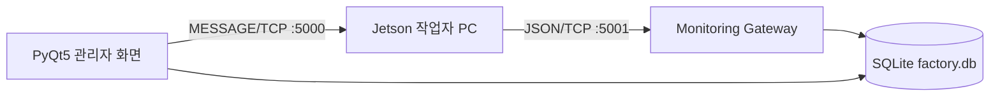

# Team STEP — Monitoring PC

**Team STEP (Sequential Tracking & Error Prevention)**의 생산 공정 관제 프로그램입니다.

작업자의 출퇴근과 제품 조립 진행 상태를 확인하고, 제품별 STEP 작업시간과 검사
PASS/FAIL, 수동 불량 기록을 관리합니다. 작업자용 Jetson PC와 TCP Socket으로 통신하며
관제 데이터는 SQLite에 저장합니다.

## 주요 기능

- 관리자 로그인
- 작업자 계정 등록 및 말소
- 직원별 출근 여부와 진행 제품·현재 STEP 확인
- 변경된 직원 상태를 1초 단위로 묶어 부분 갱신
- 직원별 출퇴근·제품 작업·STEP 작업시간·일시정지·불량 이력 조회
- 제품 등록·수정·삭제 및 STEP 수 관리
- 제품별 검사 PASS/FAIL, FAIL률, 수동 불량 횟수 집계
- 품질 통계 초기화 기준 설정(기존 이력은 보존)
- 관리자 메시지를 로그인한 작업자의 Jetson으로 전송
- 작업자 재로그인 시 완료하지 않은 제품과 STEP 복원 정보 제공
- 작업자별 Token과 실제 접속 IP 검증

## 사용 기술

- Python 3.10 이상
- PyQt5
- SQLite
- TCP Socket
- JSON Lines(JSON 문자열 + `\n`)

## 시스템 구성



- 작업자 → 관제 서버: `Monitoring PC IP:5001`
- 관리자 → 작업자: 로그인 TCP 연결에서 확인한 `Jetson IP:5000`
- 작업자 IP는 DB에 저장하지 않고 실행 중인 메모리 세션에서 관리합니다.
- 관제 프로그램을 종료하면 Gateway와 모든 Token·IP 연결이 만료됩니다.

## 설치 및 실행

### 1. 가상환경 생성

```powershell
python -m venv .venv
.\.venv\Scripts\Activate.ps1
```

### 2. 의존성 설치

```powershell
python -m pip install -r requirements.txt
```

### 3. 프로그램 실행

```powershell
python main.py
```

첫 실행 시 프로젝트 폴더에 `factory.db`가 자동으로 생성됩니다.

### 선택: 개발용 샘플 데이터 생성

```powershell
python sample_data.py
```

샘플 계정:

| 구분 | 직원번호 | 비밀번호 |
|---|---|---|
| 관리자 | `admin` | `admin1234` |
| 작업자 | `1001` | `worker1234` |

샘플 계정은 개발 및 시연용입니다. 실제 운영 데이터베이스에서는 그대로 사용하지 않는
것을 권장합니다.

## 기본 네트워크 설정

설정 파일: [`config.py`](config.py)

| 항목 | 기본값 | 설명 |
|---|---:|---|
| `WORKER_GATEWAY_HOST` | `0.0.0.0` | 작업자 요청 수신 주소 |
| `WORKER_GATEWAY_PORT` | `5001` | 작업자 요청 수신 포트 |
| `WORKER_GATEWAY_MAX_CLIENTS` | `16` | 동시에 처리할 최대 Client 수 |
| `JETSON_SERVER_PORT` | `5000` | Jetson의 관리자 메시지 수신 포트 |
| `JETSON_CONNECTION_TIMEOUT_SECONDS` | `3.0` | 관리자 메시지 연결 제한시간 |

Windows 방화벽과 현장 네트워크에서 TCP 5000·5001 포트 사용이 허용되어야 합니다.

## 작업자 → 관제 서버 API

모든 요청과 응답은 UTF-8 JSON 한 줄이며 마지막에 줄바꿈(`\n`)을 붙입니다.

### 로그인

```json
{"type":"auth","employee_id":"1001","password":"worker1234"}
```

로그인 성공 시 Token과 직원 정보, 미완료 작업 상태가 반환됩니다.

```json
{
  "ok": true,
  "token": "session-token",
  "employee": {
    "employee_id": "1001",
    "name": "홍길동",
    "role": "worker"
  },
  "work_state": {
    "product_id": "P001",
    "product_name": "스마트 액추에이터 A",
    "total_steps": 5,
    "current_step": 3,
    "state": "running",
    "last_result": "pass"
  }
}
```

이어갈 작업이 없으면 `"work_state": null`이 반환됩니다.

### 제품 목록

```json
{"type":"products","token":"session-token"}
```

`get_products`도 같은 요청으로 지원합니다.

### 작업 상태

```json
{
  "type": "state",
  "token": "session-token",
  "product_id": "P001",
  "product_name": "스마트 액추에이터 A",
  "state": "running",
  "current_step": 2,
  "total_steps": 5,
  "last_result": "waiting",
  "event": "step_pass",
  "defect_type": "",
  "detail": ""
}
```

### 로그아웃

```json
{"type":"logout","token":"session-token"}
```

`auth` 이외의 요청은 로그인 시 발급된 Token이 필요하며 로그인한 Jetson과 동일한
IP에서 요청해야 합니다.

## 관리자 → Jetson 메시지

관리자 메시지는 Jetson의 TCP 5000 포트로 다음 형식으로 전송합니다.

```text
MESSAGE|<employee_id>|<UTF-8 URL-safe Base64 메시지>
```

목적지 IP는 직원이 로그인할 때 관제 서버가 확인한 실제 TCP 접속 IP를 사용합니다.
로그인 중인 Jetson이 없으면 메시지를 전송하지 않습니다.

## 공정 및 품질 집계 기준

- `event=step_pass`
  - 새 STEP이 아니라 직전 STEP의 검사 PASS로 기록
- `last_result=fail`
  - 현재 STEP의 검사 FAIL로 기록
  - 제품 작업은 종료하지 않고 재검사 가능
- `state=complete`, `last_result=pass`
  - 마지막 STEP의 검사 PASS 1건 기록
  - 정상 완성품 1건 기록
- `event=manual_defect`, `last_result=defect`
  - 현재 STEP에 수동 불량 기록
  - 제품 작업을 불량 종료

검사 FAIL률과 완성품 불량률은 서로 다른 지표입니다.

```text
검사 FAIL률 = 검사 FAIL / (검사 PASS + 검사 FAIL) × 100
완성품 불량률 = 불량품 / 전체 완료 제품 × 100
```

## 데이터베이스

주요 관계:

```text
employees ─┬─ work_sessions
           └─ product_runs ── step_runs ─┬─ pause_logs
products ───── product_runs              ├─ judgement_logs
                                         └─ defect_logs
```

- 원본 작업자 신호: `worker_state_events`
- 품질 통계 초기화 기준: `product_quality_baselines`
- 마이그레이션 실행 여부: `app_metadata`
- 비밀번호: PBKDF2-SHA256 해시
- 저장 시각: KST 문자열
- 동시 읽기·쓰기: SQLite WAL 모드

전체 스키마는 [`dbdiagram.dbml`](dbdiagram.dbml)에서 확인할 수 있습니다.

## 주요 파일

| 파일 | 역할 |
|---|---|
| `main.py` | 프로그램 실행과 화면·Gateway 수명주기 관리 |
| `database_manager.py` | DB 스키마, 인증, CRUD, 공정 저장 및 조회 |
| `monitoring_gateway.py` | 작업자 JSON/TCP 요청과 Token 처리 |
| `tcp_client.py` | Jetson 접속 IP 관리와 관리자 메시지 전송 |
| `login_window.py` | 관리자 로그인 화면 |
| `admin_window.py` | 직원 및 제품 관리 화면 |
| `employee_detail_dialog.py` | 직원별 작업·출퇴근·불량 상세정보 |
| `step_history_dialog.py` | 제품 작업 회차별 STEP 작업시간 |
| `product_detail_dialog.py` | 제품별 STEP 품질 통계 |
| `worker_account_dialog.py` | 작업자 계정 등록 및 말소 |
| `theme.py` | 공통 PyQt 스타일 |
| `test_state_persistence.py` | DB·공정·Gateway 회귀 테스트 |

AI 코드 작업용 세부 지침과 계약은 [`AGENTS.md`](AGENTS.md)를 참고합니다.

## 테스트

```powershell
python -m unittest test_state_persistence.py
```

현재 회귀 테스트는 다음 내용을 확인합니다.

- 상태 저장과 중복 신호 억제
- STEP PASS/FAIL 연결 및 집계
- 수동 불량 처리
- 일시정지와 근무시간 계산
- 품질 통계 초기화
- 미완료 작업 복원
- 작업자 Token과 Jetson IP 연결
- 기존 DB 마이그레이션 및 이력 보존

Jetson 없이 관리자 메시지 수신을 확인하려면 다음 개발 도구를 사용할 수 있습니다.

```powershell
python mock_tcp_server.py
```

## 현재 운영 범위

- 제품 통계와 과거 이력은 수동 새로고침으로 조회합니다.
- 직원 현재 상태만 1초 동안 변경 직원번호를 모아 부분 갱신합니다.
- Jetson은 로그인 응답의 `work_state`를 읽어 화면을 복원해야 합니다.
- 현재 SQLite 구조는 단일 Monitoring PC와 소규모·중간 규모 환경에 적합합니다.
- 대규모 다중 관제 환경에서는 별도 수집 서버와 서버형 DB 도입을 검토해야 합니다.
