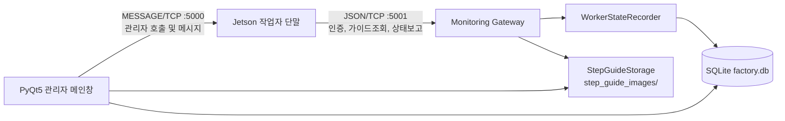

# Team STEP — Monitoring PC (관제 프로그램)

**Team STEP (Sequential Tracking & Error Prevention)**의 생산 공정 중앙 관제 프로그램입니다.

현장 작업자의 출퇴근과 제품 조립 진행 상태를 실시간 모니터링하고, 제품별 STEP 작업시간과 검사 PASS/FAIL, 수동 불량 기록을 종합 관리합니다. 작업자용 Jetson 단말과 TCP Socket으로 실시간 통신하며 관제 데이터는 SQLite에 원자적으로 저장합니다.

---

## 1. 파일 및 모듈 구조

OOP 원칙(단일 책임 원칙, Facade 패턴, Repository 패턴, 서비스 계층 분리)에 따라 구조화되어 있습니다.

```text
project_admin/
├── main.py                     # 관리자 프로그램 진입점 및 윈도우 라이프사이클 관리
├── config.py                   # DB 경로, 포트 번호, 타임아웃 등 관제 전역 설정
├── sample_data.py              # 개발 및 시연용 초기 데이터 시더 (계정, 제품, 가상 이력)
├── reset_data.py               # 관리자 계정을 제외한 모든 시스템 데이터 일괄 초기화 스크립트
├── dbdiagram.dbml              # 데이터베이스 스키마 다이어그램 정의 파일
├── factory.db                  # 공정 관제 SQLite 데이터베이스 파일
├── step_guide_images/          # 제품 STEP별 정상 기준 가이드 이미지 저장 디렉토리
├── db/                         # 데이터베이스 접근 및 리포지토리 레이어
│   ├── database_manager.py     # DB 접근 통합 Facade 인터페이스 (DatabaseManager)
│   ├── database_schema.py      # SQLite 스키마 생성 및 테이블 마이그레이션
│   ├── employee_repository.py  # 직원 정보 CRUD 및 인증 쿼리
│   ├── product_repository.py   # 제품 정보 및 STEP 정의 CRUD
│   └── work_history_repository.py # 공정/작업/불량 이력 및 품질 통계 쿼리
├── models/                     # 데이터 계약 및 타입 정의
│   └── state_types.py          # 작업자 상태 및 통신 TypedDict 정의
├── services/                   # 비즈니스 로직 및 외부 처리 서비스
│   ├── product_service.py      # 제품 CRUD 및 기준 이미지 조합 서비스
│   ├── step_guide_storage.py   # STEP 기준 이미지 WebP 변환·저장·경로 검증
│   ├── time_utils.py           # 시간 포맷팅(HH:MM:SS) 유틸리티
│   └── worker_state_recorder.py# 공정/STEP/Pause/판정/불량 상태머신 트랜잭션 기록
├── network/                    # TCP 네트워크 통신 레이어
│   ├── monitoring_gateway.py   # 작업자 PC 연동 TCP Gateway (:5001, 멀티스레드)
│   ├── tcp_client.py           # 작업자 화면 메시지/호출 전송 클라이언트 (TcpClient, :5000)
│   └── mock_tcp_server.py      # 테스트/시뮬레이션용 Mock TCP 서버
├── ui/                         # 관리자 UI 컴포넌트 레이어
│   ├── admin_window.py         # 관리자 메인 GUI (직원 모니터링, 제품 관리 탭)
│   ├── login_window.py         # 관리자 로그인 화면
│   ├── theme.py                # 시스템 공통 QSS 테마 및 컬러 팔레트
│   ├── ui_helpers.py           # 공통 UI 헬퍼 (테이블 생성/바인딩, 메트릭 카드)
│   └── dialogs/                # 상세 및 입력 다이얼로그 모달
│       ├── employee_detail_dialog.py # 직원 상세 이력 조회 및 긴급 메시지 전송
│       ├── product_detail_dialog.py  # 제품별 STEP 품질 통계 및 기준점 관리
│       ├── product_dialog.py         # 제품 및 STEP별 기준 이미지 추가/수정
│       ├── step_history_dialog.py    # 작업 회차별 STEP 작업시간 및 통계
│       └── worker_account_dialog.py  # 작업자 계정 등록/말소 다이얼로그
└── tests/                      # 자동화 단위 테스트 스위트 (45개 테스트)
    ├── test_database_facade.py
    ├── test_product_service.py
    └── test_state_persistence.py
```

---

## 2. 주요 기능

- **실시간 공정 모니터링**: 현장 작업자의 출근 여부, 현재 조립 제품, 진행 중인 STEP, 일시정지 상태 실시간 표시.
- **작업 상태 보존 및 복원 (Work State Persistence)**: 작업자 프로그램이 비정상 종료되거나 재로그인할 때 이전에 작업하던 제품과 진행 STEP, 일시정지 상태를 그대로 복원하여 작업 연속성 보장.
- **원자적 상태 전이 기록 (`WorkerStateRecorder`)**: 작업자의 상태 이벤트 수신 시 제품 회차(`product_runs`), 단계별 소요시간(`step_runs`), 일시정지 이력(`pause_logs`), 판정 로그(`judgement_logs`), 불량 이력(`defect_logs`)을 단일 트랜잭션으로 일관성 있게 갱신.
- **제품 및 STEP 정상 기준 이미지 관리**: 제품별 각 STEP의 정상 조립 기준 이미지를 등록 시 WebP 형식으로 최적화 저장(`step_guide_storage.py`)하며, 작업자 단말 요청 시 Base64로 인코딩하여 전송.
- **품질 지표 집계 및 기준점 리셋**: 제품별 STEP 단위 PASS/FAIL률 분석 및 기준점 설정(과거 이력은 보존하되 통계 집계 기준 시점 분리 가능).
- **작업자 계정 관리**: 현장 작업자 신규 등록 및 말소 (비밀번호 PBKDF2 해싱 암호화 저장).
- **양방향 긴급 호출/메시지**: 관리자가 특정 작업자에게 텍스트 메시지 및 호출 알림을 실시간 전송 (Worker PC :5000).
- **시스템 데이터 초기화 도구 (`reset_data.py`)**: 시연 및 테스트 완료 후 관리자 계정을 제외한 모든 작업자, 제품, 작업 이력 데이터를 원클릭으로 초기화.

---

## 3. 시스템 구성



- **작업자 단말 → 관제 서버**: `Monitoring PC IP:5001` (인증 요청, 제품 목록 및 STEP 기준 이미지 요청, 상태 이벤트 보고)
- **관제 서버 → 작업자 단말**: `Jetson IP:5000` (관리자 긴급 메시지 및 호출 전송)
- **동적 IP 매핑**: 작업자가 로그인할 때 연결된 IP 주소를 게이트웨이가 감지하여 `WorkerEndpointRegistry`에 등록하므로 고정 IP 설정 없이도 원활한 통신 지원.

---

## 4. 설치 및 실행 (Windows PC)

> [!IMPORTANT]
> **모든 프로그램 실행은 반드시 프로젝트 최상위 루트 디렉토리(`AI_Standard_Process_System/`)에서 수행해야 합니다.**  
> 하위 폴더(`project_admin/`)로 직접 이동하여 실행하지 마십시오.

가상환경 및 의존성 패키지가 없으면 최초 1회 자동 설치 후 즉시 실행됩니다:

### 원클릭 실행 (권장)
- 파일 탐색기에서 프로젝트 루트 디렉토리의 [`run_admin.bat`](../run_admin.bat) **더블 클릭**, 또는
- 명령 프롬프트(CMD) / PowerShell:
  ```powershell
  .\run_admin.bat
  ```

### PowerShell 전용 스크립트 실행 시
```powershell
.\run_admin.ps1
```

### 수동 가상환경 패키지 설치 시 (참고)
```bash
pip install -r requirements_admin.txt
```

---

## 5. 데이터 관리 도구

### 5.1 개발/시연용 샘플 데이터 생성
관리자, 작업자 계정 및 기본 제품, 가상 작업 이력을 일괄 생성합니다:
```bash
python3 project_admin/sample_data.py
```
- **관리자 계정**: ID `admin` / Password `admin1234`
- **작업자 계정**: ID `1001` / Password `worker1234`

### 5.2 데이터 전체 초기화 (관리자 계정 제외)
시스템 테스트 후 관리자 계정을 제외한 모든 작업자, 제품, 작업 이력, 로그를 일괄 삭제합니다:
```bash
python3 project_admin/reset_data.py
```

---

## 6. 자동화 단위 테스트 실행

데이터베이스 Facade, Gateway, 제품 서비스 및 상태 보존/복원 로직을 검증하는 45개의 단위 테스트입니다. **반드시 프로젝트 최상위 루트 디렉토리에서 실행**합니다:

```bash
PYTHONPATH=project_admin python3 -m unittest discover -s project_admin/tests -p "test*.py"
```
